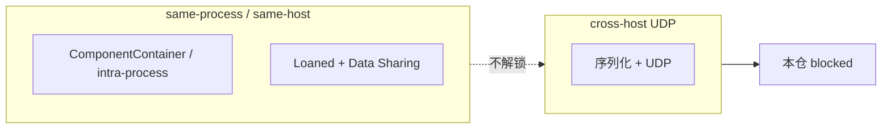

# 中日公开 ROS 2 / DDS 优化吸收（对照本仓双链）

Status: **文档对照 — 不落地旋钮。**  
查阅日期：2026-09-12。只写能核对到公开 URL 的内容；核不到的标 **未核实**，不编造数字。

三条「吸收」只进**本文**：奥比中光 Fast DDS 大缓冲、Autoware Cyclone 10MB recv window、Loaned Messages + Fast DDS Data Sharing。它们的数字与旋钮**不写进** [`config/fastdds.xml`](../../config/fastdds.xml)、SCOREBOARD 已记账表、SCOREBOARD current best、或任何现网 / 默认 XML。本仓不另写 Cyclone 示例文件。

| 允许 | 禁止（本 PR） |
|------|----------------|
| 本文 + README 一条指针 | 改 [`config/fastdds.xml`](../../config/fastdds.xml)（iter7 种子不动） |
| CI 检查本文存在 | 改 SCOREBOARD 已记账表 / current best |
| | 任何现网 / 默认 XML 写入新旋钮值 |
| | vendor Autoware / Agnocast / Isaac / zenoh / iceoryx |
| | 新增 RMW、rebase 发行版 |
| | Promptfoo / Mac 占位测 / CVE（《3》–《6》仍 **Hold**） |

**不是** 飞书现场 / 实机 / 跨机根因证明。Not Feishu field proof.

本仓契约仍是两条独立栈：[R0 接口冻结](ros2-dds-r0-interface-freeze.md)。链 A Fast-DDS 域 **42**，链 B Cyclone 域 **0**。DimOS 默认传输仍是 **LCM**（Linux）。NITROS 仍是同进程 GPU：[nitros-vs-dual-chain.md](nitros-vs-dual-chain.md)。跨机 UDP 仍 **blocked**（单机 yixin Docker DOWN）。

---

## 0. 拓扑先分清（零拷不是跨机解锁）

| 路径 | 是什么 | 不是什么 |
|------|--------|----------|
| **同进程 / 同机** 零拷 | ComponentContainer / intra-process；以及 Loaned Messages + Fast DDS Data Sharing（`rmw_fastrtps` 写明加速 **intra-host**） | **不是** 跨机 UDP 解锁 |
| **跨机 UDP** | 普通 RMW/DDS 序列化走网卡（`rmw_fastrtps` 默认 inter-host 用 UDPv4） | 本仓仍 **STATUS: blocked**（yixin Docker DOWN / 单 VM）。无假分位数 |

本 PR **不**在现网 XML 翻转 `data_sharing`。

---

## 1. 对照到本仓双链

| 公开项 | 本仓落点 | 本 PR 动作 |
|--------|----------|------------|
| TIER IV / Autoware Agnocast（未定长真零拷；kmod + `LD_PRELOAD` heaphook；`ENABLE_AGNOCAST`） | **不是** 第三条链，也不是 RMW。跨机 / rviz / rosbag 仍走现有 RMW/DDS | **Hold**：不 vendor、不装 kmod |
| Autoware / Cyclone recv window（见 TIER IV 页 + 其 ROS 2 DDS tuning） | 链 B 默认 **不** 设 `CYCLONEDDS_URI` | **只引 URL，example only**；不写 XML |
| Autoware 经典 ComponentContainer 同进程 | 同进程少拷；故障隔离 vs 零拷 | 只对照 |
| 奥比中光 Fast DDS 大缓冲（example `1048576`） | 链 A 现网仍是 iter7 种子 | **只引 URL，example only**；不改 XML |
| Loaned + Data Sharing | **same-process / same-host** 零拷 | **只对照**；**不**解锁跨机 UDP；不翻转现网 `data_sharing` |
| openEuler 24.03：Jazzy + `rmw_zenoh` 预览；Embedded Humble / SDK | 本仓 Humble + 双链 RMW；`ZenohTransport` 仍是空 stub | **Hold** 新 RMW 与 rebase |

---

## 2. 日本

### 2.1 Agnocast（TIER IV / Autoware）— Hold

公开博客：[Agnocast: A True Zero-Copy Publish/Subscribe IPC](https://autoware.org/agnocast-a-true-zero-copy-publish-subscribe-ipc/)（2025-09-24）。仓库：[tier4/agnocast](https://github.com/tier4/agnocast)（README 现指向 [autowarefoundation/agnocast](https://github.com/autowarefoundation/agnocast) 与 [Getting Started](https://autowarefoundation.github.io/agnocast_doc/environment-setup/)）。

已核实要点：

- Autoware 作为 ROS 2 应用，跨进程 pub/sub 会做多次拷贝（含序列化 / 反序列化）。他们曾用 **ComponentContainer 把节点放进同一进程** 来避开这份开销。从故障隔离看，更希望每节点独立进程，因此需要「对任意 ROS 2 消息（含 `std::vector` 等未定长类型）的真零拷 IPC」。
- Iceoryx / Iceoryx2 等生产级中间件支持真零拷，但**只覆盖静态尺寸消息**，Autoware 大量未定长类型用不了。TZC / LOT 也不是任意 ROS 2 消息。
- Agnocast：内核模块（`agnocast-kmod`，`sudo modprobe agnocast`）+ `LD_PRELOAD` heaphook（`agnocast-heaphook`）把堆分配拦到可跨进程映射的共享虚址；智能指针元数据在 kmod 里。博客写明与 ROS 2 栈**共存**，且「不受 RMW 实现变更影响」——它**不是**一个新 RMW。
- 源码侧还要改智能指针 / pub/sub 命名空间（`rclcpp` → `agnocast`）以及 launch（`LD_PRELOAD`、ComposableNode 用 Agnocast executor）。
- Autoware 集成用构建期环境变量 **`ENABLE_AGNOCAST`** 开关（博客指向 `autoware_agnocast_wrapper`）。wrapper 说明：未设或 `0` = 普通 ROS 2；`1` = Agnocast 构建。[review guide](https://github.com/autowarefoundation/autoware_core/blob/a50ac9281442b83ec240aedcb4fe78598e07c8e3/common/autoware_agnocast_wrapper/docs/review_guide.md)
- TIER IV 在 Open Robotics Discourse 写明：即使 Agnocast 构建，**跨主机通信以及依赖 RMW 的 rviz / rosbag 仍走现有 RMW 栈**；与非 Agnocast 节点靠 Bridge。[Discourse #52678](https://discourse.openrobotics.org/t/agnocast-callback-isolated-executor-true-zero-copy-ipc-and-middleware-transparent-scheduling-for-ros-2/52678)

**本仓 verdict: Hold。** 不 vendor Agnocast 树，不装 / 不加载 kmod，不加第三条链。跨机 UDP、域 42/0、Fast-DDS XML 旋钮都不在 Agnocast 覆盖范围。

### 2.2 Autoware / Cyclone recv window — 只引原文，example only

来源（Researcher 指定；**不要**抄进本仓 XML / SCOREBOARD）：

- TIER IV Autoware：[Additional settings for developers](https://tier4.github.io/autoware-documentation/latest/installation/additional-settings-for-developers/)（「DDS settings」节：CycloneDDS 默认；recv buffer 对点云 / 图像关键；示例 `CYCLONEDDS_URI` + 示例 XML 含 `SocketReceiveBufferSize min="10MB"`）。
- 该页指向的 ROS 2 DDS tuning：[Humble DDS-tuning](https://docs.ros.org/en/humble/How-To-Guides/DDS-tuning.html)。更早的 ROS 2 副本把同一 10MB recv window 写成 `MinimumSocketReceiveBufferSize` 10MB（例：[Foxy](https://docs.ros.org/en/foxy/How-To-Guides/DDS-tuning.html)）。

**Cite as example only。** 不写入 `config/fastdds.xml`、SCOREBOARD、或任何现网 / 默认 Cyclone XML。链 B 默认仍 **不** 设 `CYCLONEDDS_URI`。

### 2.3 ComponentContainer 同进程 — 对照，不落地

同一篇 Agnocast 博客：Autoware 经典做法是 **ComponentContainer 同进程**，避免跨进程序列化/拷贝；Agnocast 存在，是因为他们要 **进程隔离 + 真零拷**。

**同进程零拷 = ComponentContainer / intra-process**，不是 Data Sharing，也不是跨机 UDP。这与本仓 [NITROS 对照](nitros-vs-dual-chain.md) 同一类权衡。same-process bench 只作诚实对照，**不要为它调参**。

---

## 3. 中国大陆

### 3.1 奥比中光 Fast DDS 大缓冲 — 只引原文，example only

来源（Researcher 指定）：[Fast DDS Optimization for Orbbec Camera with ROS2](https://orbbec.github.io/OrbbecSDK_ROS2/en/source/camera_devices/5_advanced_guide/performance/fastdds_tuning.html)。

已核实：该页 `shm_fastdds.xml` **示例**里 `sendBufferSize` / `receiveBufferSize` 以及 `listenSocketBufferSize`（同文件还有 `sendSocketBufferSize`）= **1048576**。环境变量示例为 `RMW_IMPLEMENTATION=rmw_fastrtps_cpp`、`FASTRTPS_DEFAULT_PROFILES_FILE`、`RMW_FASTRTPS_USE_QOS_FROM_XML=1`。

**Cite as example only。** 不把 1048576 或他们的 `useBuiltinTransports` false 写进 [`config/fastdds.xml`](../../config/fastdds.xml) 或 SCOREBOARD。链 A 现网仍是 iter7 种子。

### 3.2 Loaned Messages + Data Sharing — same-process / same-host，不解锁跨机

来源（Researcher 指定）：

- ROS 2 Jazzy：[Configure Zero Copy Loaned Messages](https://docs.ros.org/en/jazzy/How-To-Guides/Configure-ZeroCopy-loaned-messages.html)（页标题 / og 描述已核实为 loaned messages + zero copy data sharing；正文本次抓取被 Anubis 拦下，主张以该 URL 与下一份 README 为准）。
- `rmw_fastrtps`：[Enable Zero Copy Data Sharing](https://github.com/ros2/rmw_fastrtps#enable-zero-copy-data-sharing)（本仓拷贝 [`vendor/rmw_fastrtps/README.md`](../../vendor/rmw_fastrtps/README.md) 一致）。

已核实（README）：Loaned Messages + Fast DDS Data Sharing 用来加速 **intra-host**；默认 `rmw_fastrtps_cpp` 用 Shared Memory 做 intra-host、**UDPv4 做 inter-host**。Humble 上 Loaned Messages 还要 POD + 打开 Data Sharing（`RMW_FASTRTPS_USE_QOS_FROM_XML=1` + XML `data_sharing` AUTOMATIC）。

因此：

- **same-process / same-host 零拷**。不是跨机 UDP 解锁。
- 本仓跨机 UDP 仍 **blocked**（yixin Docker DOWN）。
- **本 PR 不**在 [`config/fastdds.xml`](../../config/fastdds.xml) 加或翻转 `data_sharing`。SCOREBOARD 不抄这些旋钮。

### 3.3 openEuler 24.03 / Embedded — Hold 新 RMW 与 rebase

来源：

- [openEuler 社区 2025 年 3 月运作报告](https://www.openeuler.org/zh/news/openEuler/20250407-yb/20250407-yb.html)：openEuler **24.03 LTS** 引入 **ROS 2 Jazzy**（Turtlesim / rqt / 全套 CLI；移植工具 ROT）。文内写 Jazzy「首次引入 **rmw_zenoh 中间件预览版**」。
- [openEuler Embedded 24.03 — 嵌入式 ROS 运行时支持](https://embedded.pages.openeuler.org/openEuler-24.03-LTS/features/ros.html)：ROS2 镜像 / **快速开发 SDK**（`populate_sdk` + colcon 交叉编译）。同页写明「当前 src-openeuler 已集成 **ROS humble** 的所有软件源码」。

**本仓 verdict: Hold。** 不引入 `rmw_zenoh`（DimOS `ZenohTransport` 仍是空 stub）。不把发行版从 Humble rebase 到 Jazzy。Embedded SDK 只作公开存在证明，不 vendor、不改 Docker 配方。

---

## 4. 对本仓契约的明确「不是」

| 项 | 状态 |
|----|------|
| 链 A：`rmw_fastrtps_cpp` / 域 42 / `config/fastdds.xml` iter7 种子 | **不变** |
| 链 B：Cyclone / 域 0；默认不设 `CYCLONEDDS_URI` | **不变**；Autoware / ROS 2 DDS tuning 只引 URL |
| DimOS 默认 LCM | **不变**，仍在 DDS 范围外 |
| NITROS | 仍同进程 GPU only，见 [nitros-vs-dual-chain.md](nitros-vs-dual-chain.md) |
| Loaned + Data Sharing | **same-process / same-host**；**不是**跨机 UDP |
| 同进程少拷（组合） | ComponentContainer / intra-process |
| 跨机 UDP | 仍 **STATUS: blocked**（yixin Docker DOWN / 单 VM）；无假分位数 |
| 现网 `data_sharing` | **不翻转** |
| 《3》90%/LLM、《4》Mac/preprod、《5》Promptfoo、《6》CVE | 仍 **Hold** |
| 飞书现场 / 实机根因 | **不是。** Not Feishu field proof. |

---

## 5. 公开引用

三条吸收的 Researcher 指定 URL（2026-09-12 核对；数字只作 example，不写进现网 / SCOREBOARD）：

1. Orbbec — *Fast DDS Optimization for Orbbec Camera with ROS2*（example `sendBufferSize` / `receiveBufferSize` / `listenSocketBufferSize` = 1048576）：<https://orbbec.github.io/OrbbecSDK_ROS2/en/source/camera_devices/5_advanced_guide/performance/fastdds_tuning.html>
2. TIER IV Autoware — *Additional settings for developers*（Cyclone recv window）：<https://tier4.github.io/autoware-documentation/latest/installation/additional-settings-for-developers/>
3. 该页指向的 ROS 2 DDS tuning（Humble）：<https://docs.ros.org/en/humble/How-To-Guides/DDS-tuning.html>  
   更早副本把 10MB recv 写成 `MinimumSocketReceiveBufferSize`：<https://docs.ros.org/en/foxy/How-To-Guides/DDS-tuning.html>
4. ROS 2 Jazzy — *Configure Zero Copy Loaned Messages*：<https://docs.ros.org/en/jazzy/How-To-Guides/Configure-ZeroCopy-loaned-messages.html>
5. `ros2/rmw_fastrtps` — *Enable Zero Copy Data Sharing*（intra-host；inter-host 仍 UDPv4）：<https://github.com/ros2/rmw_fastrtps#enable-zero-copy-data-sharing>

Hold / 背景（非落地）：

6. Autoware — *Agnocast*：<https://autoware.org/agnocast-a-true-zero-copy-publish-subscribe-ipc/>
7. GitHub `tier4/agnocast`：<https://github.com/tier4/agnocast>
8. Open Robotics Discourse #52678：<https://discourse.openrobotics.org/t/agnocast-callback-isolated-executor-true-zero-copy-ipc-and-middleware-transparent-scheduling-for-ros-2/52678>
9. `ENABLE_AGNOCAST` review guide：<https://github.com/autowarefoundation/autoware_core/blob/a50ac9281442b83ec240aedcb4fe78598e07c8e3/common/autoware_agnocast_wrapper/docs/review_guide.md>
10. openEuler 2025-03 月报（Jazzy + `rmw_zenoh` 预览）：<https://www.openeuler.org/zh/news/openEuler/20250407-yb/20250407-yb.html>
11. openEuler Embedded 24.03 — 嵌入式 ROS：<https://embedded.pages.openeuler.org/openEuler-24.03-LTS/features/ros.html>
12. 本仓双链：[ros2-dds-r0-interface-freeze.md](ros2-dds-r0-interface-freeze.md) · [nitros-vs-dual-chain.md](nitros-vs-dual-chain.md)
