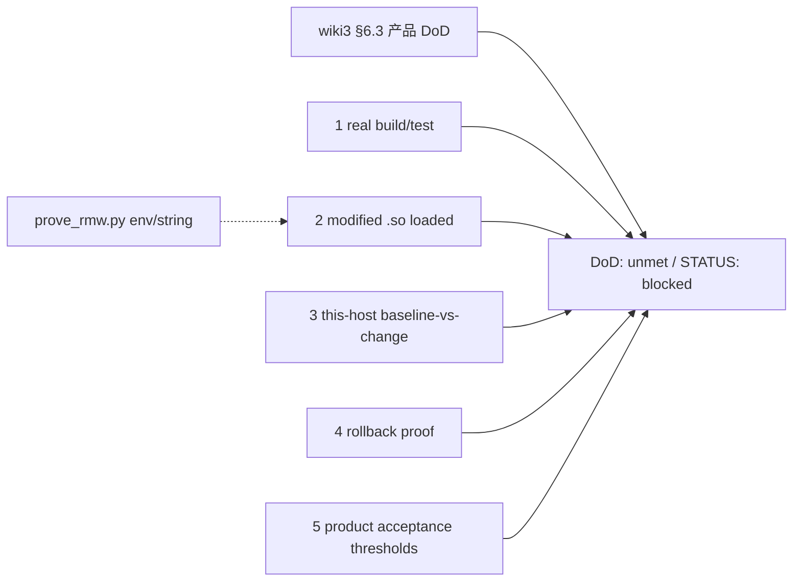

# 产品 DoD 证据（飞书 wiki3 §6.3）

Status: **DoD: unmet — `STATUS: blocked`。**  
对照飞书《ROS 2 源码闭环》<https://topsunhzj.feishu.cn/wiki/N0Xaw1vsdiXRD4km9Jvc8kHynBf> §6.3（运行时证明 / 产品完成定义）。另两份飞书计划（已在 ADR）：《通信中间件》<https://topsunhzj.feishu.cn/wiki/XKDbw7blLieO4ykCRgLcUCJKnXe>、Cyclone 工业级 fork 研究 <https://topsunhzj.feishu.cn/docx/SrokdQU4DovvdAxutNDcXByMn5e>。

本环境打不开飞书 wiki 正文（登录墙 / 抓取失败）。本页**派生自**已合入 ADR [feishu-middleware-adr.md](feishu-middleware-adr.md)、分层 [feishu-runtime-provenance.md](feishu-runtime-provenance.md)、地图 [ros2-source-map.md](ros2-source-map.md)、分段方法 [latency-attribution.md](latency-attribution.md)、Unitree 换库 [unitree-sdk2-dds-swap.md](unitree-sdk2-dds-swap.md)，以及 [`scripts/prove_rmw.py`](../../scripts/prove_rmw.py)；**不是**现场摘录，不阻塞等 wiki。SCOREBOARD 只认 [current-best **pointer**](../artifacts/bench/SCOREBOARD.md)（只读表头 / 指针，不抄已记账数字）。

**DoD: unmet.** 产品完成定义在本自动化主机上仍未满足。禁止编造 `STATUS: PASS` / `PROVEN` / 本机 `measured-delta`。禁止声称本机存在过 Humble 运行时。

**不是** 飞书现场 / 实机 / 跨机根因证明。Not Feishu field proof.

---

## 0. 硬规则

1. **产品 DoD ≠ 文档闸绿。** `check_source_map.py` / `check_runtime_provenance.py` / `prove_rmw.py` exit 0 **不是** §6.3 已验收。本页必须保持 **`DoD: unmet`** 与 **`STATUS: blocked`**。
2. **`prove_rmw.py` 是 env / 字符串身份闸，不是 modified `.so` 证明。** 它打印 `ROS_DISTRO` / `RMW_IMPLEMENTATION` / 可选 identifier / 搜索路径上的 `librmw_*.so`。无 ROS 时打印 `ROS not loaded` 并 exit 0 — 那是诚实，**不是**「改过的库已加载」。
3. **本自动化主机没有 Humble 运行时。** 没有 `/opt/ros/humble`、没有已加载发行版 `.so`、没有对本仓改过的库做实编 / 实跑。Docker 配方在 [`docker/ros/`](../../docker/ros/)，本切不启。不要写「本机跑过 Humble」。
4. **不发明分位数 / 本机 delta / PASS / PROVEN。** [SCOREBOARD.md](../artifacts/bench/SCOREBOARD.md) 是 iter7 种子 + 已记账 same-host 表的 **pointer only**；本切不重测、不重记账、不把旧表当「本机 baseline-vs-change」。跨机 UDP 仍 **blocked**。
5. **不改** [`config/fastdds.xml`](../../config/fastdds.xml)、[`docs/artifacts/bench/SCOREBOARD.md`](../artifacts/bench/SCOREBOARD.md)、vendor 源码、`dimos_bridge` 运行时 Python 模块。Agnocast / zenoh / eCAL / DPDK / Isaac / Cega / 自定义 RMW 仍 **Hold**。《3》90%/LLM、《4》Mac/preprod、《5》Promptfoo、《6》CVE 仍 Hold。

核对本页仍写 unmet / blocked：[`scripts/check_dod_evidence.py`](../../scripts/check_dod_evidence.py)。  
身份闸（env / 字符串，不是 modified `.so`）：[`scripts/prove_rmw.py`](../../scripts/prove_rmw.py)。

---

## 1. 五项产品 DoD（全部 unmet / blocked）

飞书 §6.3 要的是**产品验收证据**。本仓这一刀只把五项写成诚实未满足，并指回已有地图 / 分层 / SCOREBOARD 指针。每一项都是 **`STATUS: blocked`**。

| # | 产品 DoD | 本仓已有指针（不是本项 PASS） | 本页裁决 |
|---|---------|------------------------------|----------|
| 1 | **改过的库实编 / 实测** | vendor 是对照快照：[feishu-runtime-provenance.md](feishu-runtime-provenance.md)；地图：[ros2-source-map.md](ros2-source-map.md)。CI **不**编译 vendor | **unmet / blocked** — 本机未对 modified 库做 real build/test |
| 2 | **运行时证明加载了 modified `.so`**（超出 env / 字符串 `prove_rmw`） | [`scripts/prove_rmw.py`](../../scripts/prove_rmw.py) 只做 env / identifier / 搜索路径。分层：[feishu-runtime-provenance.md](feishu-runtime-provenance.md) | **unmet / blocked** — 无 Humble 运行时；`prove_rmw.py` → `ROS not loaded`；没有 modified `.so` 被加载 |
| 3 | **本机测过的 baseline-vs-change 时延** | 方法：[latency-attribution.md](latency-attribution.md)。数字只在 SCOREBOARD **pointer** | **unmet / blocked** — 本切未在本机重测；禁止把旧 same-host 表写成 measured-delta |
| 4 | **回滚证明** | XML / SCOREBOARD 内容冻结（`boundary` job）；本切无行为变更可回滚 | **unmet / blocked** — 没有「改完再滚回」的实测证明 |
| 5 | **产品定义的验收阈** | 频率 / 包长由产品定（latency-attribution §12.2–12.4）；bench 预订入口在 [`scripts/bench/README.md`](../../scripts/bench/README.md) | **unmet / blocked** — 本仓没有把产品阈写成已通过的 SLA；不编 Hz / 字节 / µs |



双链提醒（混用默认值是 discovery 失败，不是 DoD PASS）：链 A `rmw_fastrtps_cpp` 域 **42**；链 B Cyclone 域 **0**。Humble `rclcpp` / `rclpy` **不在 vendor**。

---

## 2. 本机为什么 blocked

| 需要 | 本自动化主机 |
|------|----------------|
| Humble underlay `/opt/ros/humble` | **无**（配方在 [`docker/ros/`](../../docker/ros/)，本切不启） |
| 对 modified 库的 real build/test | **未做。** vendor 只读对照；CI 不编译 |
| 已加载 modified `.so` | **无。** `prove_rmw.py` 是 env / 字符串；此处打印 `ROS not loaded` |
| 本机 baseline-vs-change 时延 | **未测。** SCOREBOARD 是 pointer only，不是本机 measured-delta |
| 回滚实测 | **无。** 本切不改 XML / 运行时模块 |
| 产品验收阈已通过 | **无。** 阈值仍是产品定义，不是本页 SLA |
| 飞书现场 / 跨机 UDP | **不是本页。** 跨机仍 blocked |

所以产品 DoD 只能写 **`DoD: unmet`** / **`STATUS: blocked`**。把文档闸或 `prove_rmw.py` 绿写成「§6.3 已验收」= 编造。

---

## 3. `prove_rmw.py` 覆盖到哪、盖不到哪

[`scripts/prove_rmw.py`](../../scripts/prove_rmw.py) 是 wiki3 §6.3 的**身份闸**，不是产品 DoD：

| 它会打印 | 它证明不了 |
|----------|------------|
| `ROS_DISTRO` / `RMW_IMPLEMENTATION` / `ROS_DOMAIN_ID`（env，未 source 则 unset） | 操作员已经 `source` 了链 A / 链 B |
| `rmw_get_implementation_identifier`（仅当 `rclpy` 可 import） | 加载的是**改过的** `.so`，而不是发行版 underlay |
| 搜索路径上的 `librmw_*.so` | 该文件来自本仓 overlay / 本次补丁 |
| 无 ROS：`ROS not loaded`（仍 exit 0） | Humble 运行时存在过、或 vendor 就是运行时 |

身份分层仍看 [feishu-runtime-provenance.md](feishu-runtime-provenance.md)：underlay `/opt/ros/humble` ≠ overlay ≠ `vendor/**` snapshot。Rolling ≠ Humble。

---

## 4. SCOREBOARD / 时延指针（不是本机 delta）

[SCOREBOARD.md](../artifacts/bench/SCOREBOARD.md) 表头写明：current best **config + booked tables**；**does not remasure**；**does not change middleware behavior**。本页只认这个 **pointer**。

[latency-attribution.md](latency-attribution.md) 是 wiki3 §12 / §13.3 **方法**：分段公式、禁止把各段分位相加、跨机 `STATUS: blocked`。那是怎么归因，**不是**本机测出的 baseline-vs-change。

本切不重跑 ping-pong，不抄已记账数字，不发明本机 measured-delta。跨机 UDP 仍 blocked。

---

## 5. 闸门怎么跑

```bash
python3 scripts/check_dod_evidence.py
```

无 ROS 时应 exit 0，并打印 `dod evidence: unmet (blocked)`。脚本只读本页 + 指针文件是否还在：必须保留 **`DoD: unmet`**、**`STATUS: blocked`**，五项 DoD 仍写 unmet / blocked，且不得把本页写成 PASS / PROVEN / 本机 measured-delta，也不得声称本机存在过 Humble 运行时。CI 登记见 [ci-cd-gates.md](ci-cd-gates.md)。**不要**为了本地绿去编译 vendor、启 Humble，或把 DoD 改成已满足。

| 打开 | 断言 |
|------|------|
| 本文 [`feishu-dod-evidence.md`](feishu-dod-evidence.md) | 连续 **`DoD: unmet`**、**`STATUS: blocked`**、五项未满足、`prove_rmw` = env / 字符串、Hold 标记 |
| [feishu-middleware-adr.md](feishu-middleware-adr.md) | 仍写 §6.3；本切引用仍在 |
| [feishu-runtime-provenance.md](feishu-runtime-provenance.md) · [ros2-source-map.md](ros2-source-map.md) · [latency-attribution.md](latency-attribution.md) | 指针文件还在 |
| [`scripts/prove_rmw.py`](../../scripts/prove_rmw.py) | 身份闸文件还在 |
| [`config/fastdds.xml`](../../config/fastdds.xml) | **只检查存在**。内容冻结由 CI **`boundary`** 管 |
| [`docs/artifacts/bench/SCOREBOARD.md`](../artifacts/bench/SCOREBOARD.md) | **只检查存在**。不读数字；内容冻结由 **`boundary`** 管 |

---

## 6. 引用

飞书（查阅 2026-09-12；本环境未取到 wiki 正文，本仓按已合入 ADR / 分层 / 地图 / SCOREBOARD 指针落地）：

1. 《ROS 2 源码闭环》§6.3 运行时证明 / 产品 DoD：<https://topsunhzj.feishu.cn/wiki/N0Xaw1vsdiXRD4km9Jvc8kHynBf>
2. 《通信中间件》：<https://topsunhzj.feishu.cn/wiki/XKDbw7blLieO4ykCRgLcUCJKnXe>
3. Cyclone 工业级 fork 研究：<https://topsunhzj.feishu.cn/docx/SrokdQU4DovvdAxutNDcXByMn5e>

本仓：

4. [feishu-middleware-adr.md](feishu-middleware-adr.md)
5. [feishu-runtime-provenance.md](feishu-runtime-provenance.md) — underlay vs overlay vs vendor snapshot
6. [ros2-source-map.md](ros2-source-map.md) — publish / History / wait→callback 地图（不是复现）
7. [latency-attribution.md](latency-attribution.md) — §12 分段方法（不抄 SCOREBOARD 数字）
8. [unitree-sdk2-dds-swap.md](unitree-sdk2-dds-swap.md) — 0.10.2 vs 11.0.1（drop-in FAIL / wire UNPROVEN）
9. [docs/artifacts/bench/SCOREBOARD.md](../artifacts/bench/SCOREBOARD.md) — current-best **pointer only**
10. [scripts/prove_rmw.py](../../scripts/prove_rmw.py) · [scripts/check_dod_evidence.py](../../scripts/check_dod_evidence.py)
