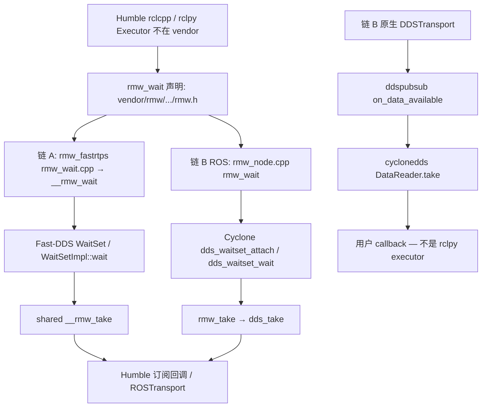

# Executor · WaitSet · callback（飞书 wiki3 §13 wait→callback）

Status: **身份地图 — 不是复现报告、不是时延数字、不是飞书现场证明。**  
对照飞书《ROS 2 源码闭环》<https://topsunhzj.feishu.cn/wiki/N0Xaw1vsdiXRD4km9Jvc8kHynBf> §13 第 (2) 步的 wait→callback 链，以及 ADR 已写的 §9.4 层序（env/XML 第一，Executor 居中，fork 最后）。另两份飞书计划（已在 ADR）：《通信中间件》<https://topsunhzj.feishu.cn/wiki/XKDbw7blLieO4ykCRgLcUCJKnXe>、Cyclone 工业级 fork 研究 <https://topsunhzj.feishu.cn/docx/SrokdQU4DovvdAxutNDcXByMn5e>。三条链复现（**map ≠ reproduce**，本主机 `STATUS: blocked`）：[feishu-three-chain-repro.md](feishu-three-chain-repro.md)。

本环境打不开飞书 wiki 正文（登录墙 / 抓取失败）。本页章节对照**派生自**已合入 ADR [feishu-middleware-adr.md](feishu-middleware-adr.md)、[ros2-source-map.md](ros2-source-map.md) §3、[latency-attribution.md](latency-attribution.md) 的 `T_rmw_take` / `T_callback`，以及本树 `vendor/` 路径；**不是**现场摘录，不阻塞等 wiki。双链契约：[ros2-dds-r0-interface-freeze.md](ros2-dds-r0-interface-freeze.md)。

**不是** 飞书现场 / 实机 / 跨机根因证明。Not Feishu field proof.

---

## 0. 硬规则

1. **Humble `rclcpp` / `rclpy` 不在 vendor。** 本仓没有 `vendor/rcl`、`vendor/rclcpp`、`vendor/rclpy`。Executor 与订阅回调在 Humble 发行版（[`docker/ros/`](../../docker/ros/)，`ROS_DISTRO=humble`）。不要拿 rolling `rmw_*.h` 去覆盖 `/opt/ros/humble`。
2. **本页只标本树里核对过存在的文件。** `rmw_wait` 返回就绪 ≠ 用户 callback 已跑；`rmw_take` / `dds_take` 取出样本 ≠ 端到端已送达。
3. **不发明分段 µs / 分位数 / 风险分。** SCOREBOARD 只是 current-best **指针**；本文不抄数字。跨机 UDP 仍 **blocked**。
4. **不改** [`config/fastdds.xml`](../../config/fastdds.xml)、SCOREBOARD 已记账表、vendor 源码、`dimos_bridge` 运行时 Python 模块。Agnocast / zenoh / eCAL / DPDK / Isaac / Cega / 自定义 RMW 仍 **Hold**。《3》–《6》仍 Hold。
5. **§9.4 层序（ADR，不是风险打分）：** env / XML 第一（本切只读契约）；RMW / DDS 旋钮其次；**Executor / WaitSet / callback 是这一层**；fork `rcl` / `rclcpp` / DDS core 最后（本仓甚至没有 vendor `rcl*`）。清单：[feishu-risk-matrix.md](feishu-risk-matrix.md)。
6. **一次一层。** 本切 = wait→callback 身份地图 + vanilla 证明脚本。不编译 vendor。

核对「加载了哪个 RMW」：[`scripts/prove_rmw.py`](../../scripts/prove_rmw.py)（§6.3）。  
核对总图还在：[`scripts/check_source_map.py`](../../scripts/check_source_map.py)。  
核对本页路径 / 符号 / Humble 未 vendor：[`scripts/check_executor_map.py`](../../scripts/check_executor_map.py)。

---

## 1. 双链：WaitSet → `rmw_wait` → take → callback

两条**独立**栈（链 A 域 **42** / Fast-DDS，链 B 域 **0** / Cyclone）。混用默认值是 discovery 失败，不是单栈 callback 慢。

| 链 | RMW / DDS | 域 | 谁在 spin |
|----|-----------|----|-----------|
| **A** | `rmw_fastrtps_cpp` → Fast-DDS | **42**（[`config/env/chain_a.sh`](../../config/env/chain_a.sh)） | Humble `rclcpp::Executor` / `rclpy.executors`（**不在 vendor**）。DimOS 拷贝 [`rospubsub.py`](../../dimos_bridge/dimos/protocol/pubsub/impl/rospubsub.py) 用发行版 `SingleThreadedExecutor.spin_once` |
| **B（ROS 客户端）** | `rmw_cyclonedds_cpp` → Cyclone | **0**（[`config/env/chain_b.sh`](../../config/env/chain_b.sh)，默认不设 `CYCLONEDDS_URI`） | 同上 Humble executor（**不在 vendor**） |
| **B（DimOS 原生）** | 原生 Cyclone reader | **0** | **不走** ROS executor。[`ddspubsub.py`](../../dimos_bridge/dimos/protocol/pubsub/impl/ddspubsub.py) `on_data_available` → `reader.take()` |



### 1.1 链 A（Fast-DDS / `rmw_fastrtps_cpp` / 域 42）

| 步骤 | 本仓路径（rolling vendor，对照阅读） | 符号 |
|------|--------------------------------------|------|
| RMW 声明 | [`vendor/rmw/rmw/include/rmw/rmw.h`](../../vendor/rmw/rmw/include/rmw/rmw.h) | `rmw_wait` / `rmw_take` |
| RMW `rmw_wait` 入口 | [`vendor/rmw_fastrtps/rmw_fastrtps_cpp/src/rmw_wait.cpp`](../../vendor/rmw_fastrtps/rmw_fastrtps_cpp/src/rmw_wait.cpp) → shared [`.../rmw_fastrtps_shared_cpp/src/rmw_wait.cpp`](../../vendor/rmw_fastrtps/rmw_fastrtps_shared_cpp/src/rmw_wait.cpp) | `rmw_wait` → `__rmw_wait`；就绪探测 `DataReader::get_first_untaken_info`；`WaitSet` / `GuardCondition` |
| DDS WaitSet | [`vendor/Fast-DDS/src/cpp/fastdds/core/condition/WaitSet.cpp`](../../vendor/Fast-DDS/src/cpp/fastdds/core/condition/WaitSet.cpp)、[`WaitSetImpl.cpp`](../../vendor/Fast-DDS/src/cpp/fastdds/core/condition/WaitSetImpl.cpp)；头 [`WaitSet.hpp`](../../vendor/Fast-DDS/include/fastdds/dds/core/condition/WaitSet.hpp) | `WaitSet::wait` / `WaitSetImpl::wait` |
| RMW `rmw_take` | [`vendor/rmw_fastrtps/rmw_fastrtps_shared_cpp/src/rmw_take.cpp`](../../vendor/rmw_fastrtps/rmw_fastrtps_shared_cpp/src/rmw_take.cpp) | `__rmw_take` |
| Executor / 用户回调 | **不在本仓。** Humble `/opt/ros/humble` 的 `rclcpp::Executor` / `rclpy.executors` | 本仓只到 `rmw_wait` / `rmw_take` |
| DimOS 链 A 桥（只读对照） | [`dimos_bridge/dimos/protocol/pubsub/impl/rospubsub.py`](../../dimos_bridge/dimos/protocol/pubsub/impl/rospubsub.py) | 发行版 `SingleThreadedExecutor`；**不改**此模块 |

装载仍走 [`vendor/rmw_implementation/rmw_implementation/src/functions.cpp`](../../vendor/rmw_implementation/rmw_implementation/src/functions.cpp) `load_library()`（`RMW_IMPLEMENTATION`）。标识符 [`vendor/rmw_fastrtps/rmw_fastrtps_cpp/src/identifier.cpp`](../../vendor/rmw_fastrtps/rmw_fastrtps_cpp/src/identifier.cpp) `rmw_fastrtps_cpp`。

### 1.2 链 B ROS 客户端（Cyclone / `rmw_cyclonedds_cpp` / 域 0）

| 步骤 | 本仓路径 | 符号 |
|------|----------|------|
| RMW 声明 | 同 `rmw.h` | `rmw_wait` / `rmw_take` |
| RMW wait / take | [`vendor/rmw_cyclonedds/rmw_cyclonedds_cpp/src/rmw_node.cpp`](../../vendor/rmw_cyclonedds/rmw_cyclonedds_cpp/src/rmw_node.cpp) | `rmw_wait` → `dds_waitset_attach` / `dds_waitset_wait`；`rmw_take` → `dds_take` |
| DDS waitset | [`vendor/CycloneDDS/src/core/ddsc/src/dds_waitset.c`](../../vendor/CycloneDDS/src/core/ddsc/src/dds_waitset.c) | `dds_waitset_attach` / `dds_waitset_wait` |
| DDS take | [`vendor/CycloneDDS/src/core/ddsc/src/dds_read.c`](../../vendor/CycloneDDS/src/core/ddsc/src/dds_read.c) | `dds_take` |
| Executor / 用户回调 | **不在 vendor。** 与链 A 同一份 Humble `rclcpp` / `rclpy` | 换的是 `.so`，不是另一套 executor 源码 |

标识符：`rmw_cyclonedds_cpp` ← `eclipse_cyclonedds_identifier`（同 `rmw_node.cpp`）。

### 1.3 链 B 原生（不走 ROS Executor）

DimOS `DDSTransport` 绑 [`ddspubsub.py`](../../dimos_bridge/dimos/protocol/pubsub/impl/ddspubsub.py)：Cyclone Python `Listener.on_data_available` 里 `reader.take()`，再调用户 callback。这是 **DDS listener**，不是 `rclpy.executors`，也不是 `rmw_wait`。本切只标路径，**不改** `dimos_bridge` 运行时行为。

入 Reader History 仍在 callback 之前：见源码地图 §2（`StatefulReader` / `ddsi_rhc`）。入 History ≠ callback 已跑。

---

## 2. Humble 运行时 vs rolling vendor（本层）

| 层 | 运行时 | 本仓 |
|----|--------|------|
| Executor / 回调 | Humble `rclcpp::Executor` / `rclpy.executors` | **无** `vendor/rclcpp`、`vendor/rclpy` |
| `rcl` wait 封装 | 发行版 `librcl.so` | **无** `vendor/rcl` |
| RMW wait/take | 发行版 `librmw_*.so` | vendor rolling 对照：上表路径 |
| 链 A DDS WaitSet | 发行版 Fast-DDS 2.x | `vendor/Fast-DDS` `master` 快照 |
| 链 B DDS waitset | 发行版或原生 `cyclonedds` | `vendor/CycloneDDS` tag **11.0.1** |

语义冻结：[vendor/MANIFEST.md](../../vendor/MANIFEST.md)。Rolling / master **严禁**直接覆盖 Humble。

---

## 3. 闸门怎么跑

```bash
python3 scripts/check_executor_map.py
python3 scripts/check_source_map.py
python3 scripts/prove_rmw.py
```

无 ROS 时三个脚本都应能 exit 0。`check_executor_map.py` 只解析本页：引用路径存在、允许清单符号仍在、Humble `rcl*` 仍未 vendor、三份飞书 URL 仍在。行号过期但符号还在 → 警告；文件或符号消失 → 失败。CI 登记见 [ci-cd-gates.md](ci-cd-gates.md)。**不要**为了本地绿去编译 vendor。

---

## 4. 引用

飞书（查阅 2026-09-12；本环境未取到 wiki 正文，本仓按已合入 ADR / 源码地图 / 时延归因 / vendor 路径落地）：

1. 《ROS 2 源码闭环》§13 wait→callback / §9.4 层序：<https://topsunhzj.feishu.cn/wiki/N0Xaw1vsdiXRD4km9Jvc8kHynBf>
2. 《通信中间件》：<https://topsunhzj.feishu.cn/wiki/XKDbw7blLieO4ykCRgLcUCJKnXe>
3. Cyclone 工业级 fork 研究：<https://topsunhzj.feishu.cn/docx/SrokdQU4DovvdAxutNDcXByMn5e>

本仓：

4. [feishu-middleware-adr.md](feishu-middleware-adr.md)
5. [ros2-source-map.md](ros2-source-map.md)
6. [latency-attribution.md](latency-attribution.md)
7. [feishu-risk-matrix.md](feishu-risk-matrix.md)
8. [ros2-dds-r0-interface-freeze.md](ros2-dds-r0-interface-freeze.md)
9. [scripts/check_executor_map.py](../../scripts/check_executor_map.py) · [scripts/check_source_map.py](../../scripts/check_source_map.py) · [scripts/prove_rmw.py](../../scripts/prove_rmw.py) · [scripts/check_risk_matrix.py](../../scripts/check_risk_matrix.py)
