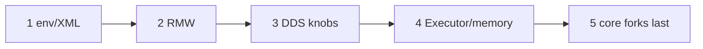

# 风险矩阵（飞书 wiki3 §9.4 → 本仓 Hold）

Status: **清单 — 不发明风险分数、不重写 SCOREBOARD。**  
对照飞书《ROS 2 源码闭环》<https://topsunhzj.feishu.cn/wiki/N0Xaw1vsdiXRD4km9Jvc8kHynBf> §9.4（层序：env/XML 第一优先 → RMW → DDS knobs → Executor/memory → core forks 最后）。决策见 [feishu-middleware-adr.md](feishu-middleware-adr.md)。双链契约见 [ros2-dds-r0-interface-freeze.md](ros2-dds-r0-interface-freeze.md)。链路文件见 [ros2-source-map.md](ros2-source-map.md)。时延怎么分段（不抄数字）见 [latency-attribution.md](latency-attribution.md)。CI job 名见 [ci-cd-gates.md](ci-cd-gates.md)。

当前最佳指针（iter7 XML 种子 + 已记账 same-host 表）只看 [`docs/artifacts/bench/SCOREBOARD.md`](../artifacts/bench/SCOREBOARD.md) — **不要**把那边的分位数抄进本文当新结论或风险分。

**不是** 飞书现场 / 实机 / 跨机根因证明。Not Feishu field proof.

飞书正文需登录。本仓按 ADR 已决条款落地层序与 Hold；不编造 wiki 里没写进 ADR 的分数、概率、P99。

---

## 0. 硬规则（§9.4 + 本仓 Hold）

1. **一次只动一层，且按飞书顺序。** env/XML 第一优先；fork `rcl` / `rclcpp` / DDS core **最后**。本仓甚至没有 vendor `rcl` / `rclcpp`。
2. **不发明风险分数。** 本文是清单，不是打分表。禁止编造 High/Medium/Low 百分比、风险指数、或把 SCOREBOARD 分位数当成「风险」。
3. **[`config/fastdds.xml`](../../config/fastdds.xml) 只读**（iter7 种子）。[`SCOREBOARD.md`](../artifacts/bench/SCOREBOARD.md) 数字冻结。本文只做 **pointer**。
4. **Rolling ≠ Humble。** vendor 树是 rolling / master 快照，运行时目标是 Humble。严禁把 vendor 文件直接覆盖发行版树。见 [vendor/MANIFEST.md](../../vendor/MANIFEST.md)。
5. **跨机 UDP 仍 blocked。** 单机 / 无第二台时写 `STATUS: blocked`，禁止填假分位数。见 [`2026-09-11-cross-host/`](../artifacts/bench/2026-09-11-cross-host/README.md)。
6. **Agnocast / zenoh / Cega / 自定义 RMW 仍 Hold。** 不 vendor、不接、不把 stub 当可用路径。《3》–《6》仍 Hold。不改 `dimos_bridge` 运行时模块。

核对「加载了哪个 RMW」：[`scripts/prove_rmw.py`](../../scripts/prove_rmw.py)（§6.3，身份闸，**不是**风险分）。  
核对本仓源码地图还在：[`scripts/check_source_map.py`](../../scripts/check_source_map.py)。  
核对 bench 指针 / STATUS 还在：[`scripts/print_bench_gates.py`](../../scripts/print_bench_gates.py)。  
核对本清单层序 / Hold 标记还在：[`scripts/check_risk_matrix.py`](../../scripts/check_risk_matrix.py)（本文配套，只读，**不打分**）。  
核对 WaitSet → callback 身份地图还在：[`scripts/check_executor_map.py`](../../scripts/check_executor_map.py)。

---

## 1. wiki3 §9.4 层序 × 本仓 Hold

飞书要求差异化下沉到 RMW / DDS / Executor / 内存，但**先动环境与 XML，最后才碰 core fork**。映射到本仓两条**独立**栈（不共享域 / RMW / QoS，除非操作员显式对齐）：

| 链 | 角色 | 契约 |
|----|------|------|
| **A** | 导航 FastDDS | `rmw_fastrtps_cpp`，`ROS_DOMAIN_ID=42`，[`config/fastdds.xml`](../../config/fastdds.xml)（**只读**） |
| **B** | DimOS 原生 Cyclone | 域 **0**；ROS 侧名 `rmw_cyclonedds_cpp`。**不**设 `CYCLONEDDS_URI` |

| 顺序 | §9.4 层 | 飞书要什么 | 本仓落点 | 本切 / Hold |
|------|---------|------------|----------|-------------|
| 1 | **env / XML** | 第一优先：先对齐发行版环境与现网 XML，再谈代码 | [`config/env/`](../../config/env/)（必须显式 `source` / apply）；链 A 契约种子 [`config/fastdds.xml`](../../config/fastdds.xml) | **只读现网契约。** 不改 XML，不静默写 `os.environ` |
| 2 | **RMW** | 用 `RMW_IMPLEMENTATION` 切换；先量化再谈自研 | 链 A `rmw_fastrtps_cpp` / 链 B `rmw_cyclonedds_cpp`；身份闸 [`prove_rmw.py`](../../scripts/prove_rmw.py) | **无自定义 RMW。** Agnocast / `rmw_zenoh` **Hold** |
| 3 | **DDS knobs** | 旋钮只动一层；高吞吐同机不要默认 Cyclone **网络** XML | 链 A 旋钮已冻在 iter7 XML；链 B 不设 `CYCLONEDDS_URI`。数字只在 SCOREBOARD **指针** | **不发明新旋钮、不重记账。** 中日公开 knobs 只对照：[cn-jp-ros2-absorb.md](cn-jp-ros2-absorb.md) |
| 4 | **Executor / memory** | 差异化可下沉到 Executor / 内存，但排在 XML / RMW / DDS knobs 之后 | Humble `rclcpp` / `rclpy` **不在** `vendor/`。源码地图只标到 `rmw_wait` / `rmw_take`；加深：[feishu-executor-waitset.md](feishu-executor-waitset.md) | **不 fork Executor。** Loaned / Data Sharing / 内存补丁 **不落地** |
| 5 | **core forks** | 最后：fork `rcl` / `rclcpp` / Fast-DDS / Cyclone 核心 | 本仓 **无** vendor `rcl` / `rclcpp`。`vendor/Fast-DDS` / `vendor/CycloneDDS` 是对照快照 | **本切不做。** Rolling 源码直接覆盖 Humble = **严禁** |



**禁止：** 跳过 env/XML 直接改 RMW / DDS 核心。  
**禁止：** 给上表各层编造风险分、概率、或「P99 风险」。  
**禁止：** 把 `same-process` / `same-host` 分位数当成跨机或现场风险。跨机仍 **blocked**。  
**禁止：** 链 A 与链 B 进同一张风险对照表。混用默认值是 **discovery 失败**，不是单栈风险。

---

## 2. 本仓 Hold 清单（可核对，不是打分）

| 闸门 | 状态 | 指针（不抄数字） |
|------|------|------------------|
| [`config/fastdds.xml`](../../config/fastdds.xml) | **只读**（iter7 种子） | [`config/fastdds.zh.md`](../../config/fastdds.zh.md) |
| [`SCOREBOARD.md`](../artifacts/bench/SCOREBOARD.md) | **冻结** current best | 只认该页指针；本文与 CI **不**改数字 |
| Agnocast / zenoh / eCAL / DPDK / Isaac | **Hold** | [cn-jp-ros2-absorb.md](cn-jp-ros2-absorb.md)、ADR §3 |
| Cega / 自研 Bridge / 自定义 RMW | **Hold** | ADR §13(4)；[feishu-cega-bridge-hold.md](feishu-cega-bridge-hold.md)；不改 `dimos_bridge` 运行时 |
| Rolling ≠ Humble | **严禁** 覆盖 | [vendor/MANIFEST.md](../../vendor/MANIFEST.md) |
| 跨机 UDP | **blocked** | [`2026-09-11-cross-host/`](../artifacts/bench/2026-09-11-cross-host/README.md) |
| 《3》90%/LLM、《4》Mac/preprod、《5》Promptfoo、《6》CVE | **Hold** | [ci-cd-gates.md](ci-cd-gates.md) |

身份先于「风险层」：先 `prove_rmw.py`（加载了谁）和 `check_source_map.py`（地图还在），再谈「该动 §9.4 哪一层」。vendor SHA **不能**当根因。

---

## 3. 闸门怎么跑

```bash
python3 scripts/check_risk_matrix.py
python3 scripts/print_bench_gates.py
python3 scripts/prove_rmw.py
python3 scripts/check_source_map.py
```

无 ROS 时四个脚本都应能 exit 0（缺必填文件或 Hold 标记则 `check_risk_matrix.py` exit 1）。CI 登记见 [ci-cd-gates.md](ci-cd-gates.md)。**不要**为了本地绿去编译 vendor。

---

## 4. 引用

飞书（查阅 2026-09-12；wiki 正文需登录，本仓按 ADR 已决的 §9.4 层序落地）：

1. 《ROS 2 源码闭环》§9.4：<https://topsunhzj.feishu.cn/wiki/N0Xaw1vsdiXRD4km9Jvc8kHynBf>
2. 《通信中间件》：<https://topsunhzj.feishu.cn/wiki/XKDbw7blLieO4ykCRgLcUCJKnXe>
3. Cyclone 工业级 fork 研究：<https://topsunhzj.feishu.cn/docx/SrokdQU4DovvdAxutNDcXByMn5e>

本仓：

4. [feishu-middleware-adr.md](feishu-middleware-adr.md)
5. [ros2-dds-r0-interface-freeze.md](ros2-dds-r0-interface-freeze.md)
6. [ros2-source-map.md](ros2-source-map.md)
7. [latency-attribution.md](latency-attribution.md)
8. [ci-cd-gates.md](ci-cd-gates.md)
9. [docs/artifacts/bench/SCOREBOARD.md](../artifacts/bench/SCOREBOARD.md) — **pointer only**
10. [scripts/check_risk_matrix.py](../../scripts/check_risk_matrix.py) · [scripts/prove_rmw.py](../../scripts/prove_rmw.py) · [scripts/check_source_map.py](../../scripts/check_source_map.py) · [scripts/print_bench_gates.py](../../scripts/print_bench_gates.py)
