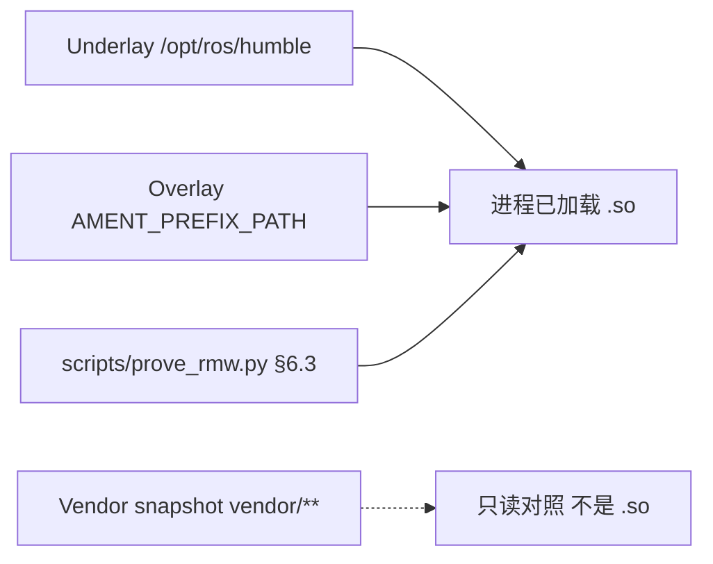

# 运行时 provenance（飞书 wiki3 §13 (1)/(6)：underlay vs overlay vs vendor snapshot）

Status: **分层记录 — 不是已加载 `.so` 证明、不是飞书现场、不是跨机根因。**  
对照飞书《ROS 2 源码闭环》<https://topsunhzj.feishu.cn/wiki/N0Xaw1vsdiXRD4km9Jvc8kHynBf> §13 第 (1) 步（冻 `ROS_DISTRO` + exact manifest）与第 (6) 步（CI 核对文档 / 钉扎仍一致）。另两份飞书计划（已在 ADR）：《通信中间件》<https://topsunhzj.feishu.cn/wiki/XKDbw7blLieO4ykCRgLcUCJKnXe>、Cyclone 工业级 fork 研究 <https://topsunhzj.feishu.cn/docx/SrokdQU4DovvdAxutNDcXByMn5e>。

本环境打不开飞书 wiki 正文（登录墙 / 抓取失败）。本页章节对照**派生自**已合入 ADR [feishu-middleware-adr.md](feishu-middleware-adr.md)、[vendor/MANIFEST.md](../../vendor/MANIFEST.md)、[vendor/VERSIONS.md](../../vendor/VERSIONS.md)、[`docker/ros/Dockerfile`](../../docker/ros/Dockerfile)；**不是** Feishu field / 跨机证明，不阻塞等 wiki。双链契约：[ros2-dds-r0-interface-freeze.md](ros2-dds-r0-interface-freeze.md)。

**不是** 飞书现场 / 实机 / 跨机根因证明。Not Feishu field proof.

---

## 0. 硬规则

1. **Underlay 才是发行版运行时。** Docker [`docker/ros/Dockerfile`](../../docker/ros/Dockerfile) 写 `ENV ROS_DISTRO=humble`。进程真正链接的树是 **`/opt/ros/humble`**（再加下面的 overlay，如果有）。
2. **Overlay 仍是运行时，不是 vendor。** 工作区 install prefix / `AMENT_PREFIX_PATH` 若存在，排在发行版前面，但仍是已安装前缀，不是 `vendor/**` 源码树。
3. **Vendor snapshot 只对照阅读。** `vendor/**` 是 rolling / master 快照，SHA **只**在 [VERSIONS.md](../../vendor/VERSIONS.md)。**不要**把 vendor 路径写成已加载 `.so`。
4. **身份闸是 `prove_rmw.py`，不是 vendor 路径。** wiki3 §6.3：[scripts/prove_rmw.py](../../scripts/prove_rmw.py) 看进程里的 identifier / `librmw_*.so`。
5. **Rolling ≠ Humble。严禁覆盖。** 见 [vendor/MANIFEST.md](../../vendor/MANIFEST.md)。不要把 rolling / master 文件直接铺进 `/opt/ros/humble` 或 Humble 工作区。
6. **不改** [`config/fastdds.xml`](../../config/fastdds.xml)、SCOREBOARD 已记账表、vendor 源码、`dimos_bridge` 运行时 Python 模块。Agnocast / zenoh / eCAL / DPDK / Isaac / Cega / 自定义 RMW 仍 **Hold**。《3》–《6》仍 Hold。跨机 UDP 仍 **blocked**。

核对本页 + MANIFEST / VERSIONS / Dockerfile 钉扎仍一致：[`scripts/check_runtime_provenance.py`](../../scripts/check_runtime_provenance.py)。  
核对「加载了哪个 RMW」：[`scripts/prove_rmw.py`](../../scripts/prove_rmw.py)。

---

## 1. 三层（不要混成一张「谁更快」表）



| 层 | 是什么 | 本仓钉扎 | 是不是已加载 `.so` |
|----|--------|----------|-------------------|
| **Underlay** | 发行版 ROS 前缀 **`/opt/ros/humble`** | [`docker/ros/Dockerfile`](../../docker/ros/Dockerfile) `ENV ROS_DISTRO=humble`（Ubuntu 22.04）。镜像**不**写 `RMW_IMPLEMENTATION` / `ROS_DOMAIN_ID` / `FASTRTPS_*` | **是**（缺 overlay 时就是它） |
| **Overlay** | 工作区 install prefix / `AMENT_PREFIX_PATH`（若有） | 本仓**没有**自有 `src/` overlay / `colcon` 工作区配方。有则仍是运行时前缀 | **是**（仍是已安装树，不是 vendor） |
| **Vendor snapshot** | `vendor/**` rolling / master 整树拷贝 | 语义：[MANIFEST.md](../../vendor/MANIFEST.md)；六行 SHA **只**在 [VERSIONS.md](../../vendor/VERSIONS.md) | **不是。** 只读对照 |

本仓根目录没有可 `colcon build` 的第一方 overlay。镜像里的 `python3-colcon-common-extensions` 是 Humble 运行时依赖，不是本仓工作区。

---

## 2. 双链提醒（分写，不混表）

两条**独立**栈。混用默认值是 **discovery 失败**，不是「underlay 选错了」或单栈时延。

### 2.1 链 A — Fast-DDS / 域 42

运行时契约：`rmw_fastrtps_cpp`，`ROS_DOMAIN_ID=42`，[`config/env/chain_a.sh`](../../config/env/chain_a.sh)（`FASTRTPS_DEFAULT_PROFILES_FILE` → [`config/fastdds.xml`](../../config/fastdds.xml)，**只读**）。  
Underlay 里的发行版 `.so` 才是默认加载对象。`vendor/rmw_fastrtps` / `vendor/Fast-DDS`（rolling / `master` 快照）是对照阅读，不是链 A 已加载库。

### 2.2 链 B — Cyclone / 域 0

运行时契约：原生 Cyclone 域 **0**；ROS 侧名 `rmw_cyclonedds_cpp`。[`config/env/chain_b.sh`](../../config/env/chain_b.sh) 默认 **不**设 `CYCLONEDDS_URI`。  
`vendor/rmw_cyclonedds`（rolling）+ `vendor/CycloneDDS`（发行标签 **11.0.1**，见 VERSIONS）是对照阅读，不是链 B 已加载库。

不要把链 A 与链 B 的 underlay / vendor 行推进同一张对照表去比快慢。身份仍走 `prove_rmw.py`。

---

## 3. Rolling ≠ Humble / 严禁覆盖

vendor 里的 `package.xml` 版本（例如 `rmw` `7.11.2`、`rmw_fastrtps_cpp` `9.5.2`、Fast-DDS `master`）**大于** Humble 发行版对应包。这是 **Vendor snapshot**，不是 Humble overlay，更不是 underlay。

**严禁覆盖：** 不要把 `vendor/rmw/**`、`vendor/rmw_fastrtps/**`、`vendor/Fast-DDS/**` 或其它 rolling / master 文件直接铺进 `/opt/ros/humble` 或 Humble 工作区，除非经过语义 backport（另开 PR，写明 ABI / 行为差）。权威段落：[vendor/MANIFEST.md](../../vendor/MANIFEST.md)。

---

## 4. 身份怎么证明

| 问题 | 看谁 | 不看谁 |
|------|------|--------|
| 这个进程加载了哪个 RMW？ | [`scripts/prove_rmw.py`](../../scripts/prove_rmw.py)（wiki3 §6.3）：`rmw_get_implementation_identifier` / `librmw_*.so` / `AMENT_PREFIX_PATH` / `/opt/ros/$ROS_DISTRO` | `vendor/**` 路径、VERSIONS SHA、本页表格 |
| Humble 钉扎还在吗？ | Dockerfile `ENV ROS_DISTRO=humble` + MANIFEST「目标运行时」 | 飞书正文、跨机 UDP |
| rolling / master 快照还钉着吗？ | VERSIONS 六行 SHA 表（结构还在即可，**不**在本闸发明新 SHA） | 把 SHA 写成时延根因 |

无 ROS 的盒子上 `prove_rmw.py` 仍 exit 0，并打印 `ROS not loaded`。那只说明本机没装发行版，**不是**「vendor 就是运行时」。

---

## 5. 闸门怎么跑

```bash
python3 scripts/check_runtime_provenance.py
python3 scripts/prove_rmw.py
```

无 ROS 时两个脚本都应能 exit 0。`check_runtime_provenance.py` 只读本页 + MANIFEST + VERSIONS + Dockerfile：必填文件在、Humble underlay 标记在、vendor 是 rolling / master 快照、VERSIONS 六行 SHA 表还在。成功时打印 `underlay != vendor snapshot`。CI 登记见 [ci-cd-gates.md](ci-cd-gates.md)。**不要**为了本地绿去编译 vendor。

---

## 6. 引用

飞书（查阅 2026-09-12；本环境未取到 wiki 正文，本仓按已合入 ADR / MANIFEST / VERSIONS / Dockerfile 落地）：

1. 《ROS 2 源码闭环》§13 (1) 冻 `ROS_DISTRO` + manifest / (6) CI：<https://topsunhzj.feishu.cn/wiki/N0Xaw1vsdiXRD4km9Jvc8kHynBf>
2. 《通信中间件》：<https://topsunhzj.feishu.cn/wiki/XKDbw7blLieO4ykCRgLcUCJKnXe>
3. Cyclone 工业级 fork 研究：<https://topsunhzj.feishu.cn/docx/SrokdQU4DovvdAxutNDcXByMn5e>

本仓：

4. [feishu-middleware-adr.md](feishu-middleware-adr.md)
5. [vendor/MANIFEST.md](../../vendor/MANIFEST.md) · [vendor/VERSIONS.md](../../vendor/VERSIONS.md)
6. [docker/ros/Dockerfile](../../docker/ros/Dockerfile) · [docker/ros/NOTES.md](../../docker/ros/NOTES.md)
7. [ros2-dds-r0-interface-freeze.md](ros2-dds-r0-interface-freeze.md)
8. [feishu-executor-waitset.md](feishu-executor-waitset.md) · [feishu-risk-matrix.md](feishu-risk-matrix.md)
9. [scripts/check_runtime_provenance.py](../../scripts/check_runtime_provenance.py) · [scripts/prove_rmw.py](../../scripts/prove_rmw.py)
