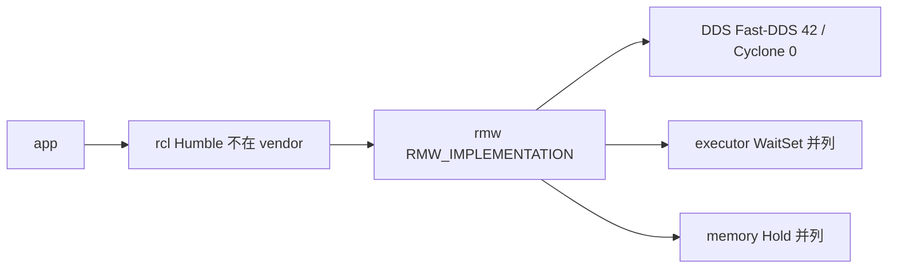

# 飞书《通信中间件》差异化下沉层（RMW / DDS / Executor）

Status: **分层清单 — Hold vs allowed；不是已改中间件、不是飞书现场、不是跨机根因。**  
对照飞书《通信中间件》<https://topsunhzj.feishu.cn/wiki/XKDbw7blLieO4ykCRgLcUCJKnXe>（差异化下沉到 RMW / DDS / Executor / 内存，不重写整套中间件）。另两份飞书计划（已在 ADR）：《ROS 2 源码闭环》<https://topsunhzj.feishu.cn/wiki/N0Xaw1vsdiXRD4km9Jvc8kHynBf>、Cyclone 工业级 fork 研究 <https://topsunhzj.feishu.cn/docx/SrokdQU4DovvdAxutNDcXByMn5e>。

本环境打不开飞书 wiki 正文（登录墙 / 抓取失败）。本页章节对照**派生自**已合入 ADR [feishu-middleware-adr.md](feishu-middleware-adr.md)、[ros2-source-map.md](ros2-source-map.md)、[feishu-executor-waitset.md](feishu-executor-waitset.md)；**不是** live Feishu excerpt，不阻塞等 wiki。双链契约：[ros2-dds-r0-interface-freeze.md](ros2-dds-r0-interface-freeze.md)。

**不是** 飞书现场 / 实机 / 跨机根因证明。Not Feishu field proof. 无假分位数。

---

## 0. 硬规则

1. **不重写整套中间件。** 《通信中间件》的落点是差异化下沉到 **RMW / DDS / Executor / memory**，应用仍走 ROS 2 API。次优「上层再抽 module 双堆」**本仓不做**。
2. **不改 config/fastdds.xml / SCOREBOARD。** [`config/fastdds.xml`](../../config/fastdds.xml) 与 [`docs/artifacts/bench/SCOREBOARD.md`](../artifacts/bench/SCOREBOARD.md) 已记账数字只做 **pointer**；内容冻结由 CI `boundary` 管。
3. **不启用 Agnocast / zenoh。** 亦不接 eCAL / DPDK / Isaac / Cega / 自定义 RMW。不 vendor `rmw_zenoh`，不装 kmod。不改 `dimos_bridge` 运行时 Python 模块、不改 vendor 源码。
4. **《3》–《6》仍 Hold。** 《3》90%/LLM、《4》Mac/preprod、《5》Promptfoo、《6》CVE。跨机 UDP 仍 **blocked**。
5. **Rolling ≠ Humble。** vendor 是对照快照，不是 `/opt/ros/humble` 已加载 `.so`。见 [feishu-runtime-provenance.md](feishu-runtime-provenance.md)。
6. **三条链 map ≠ reproduce。** publish / ingress→History / wait→callback 只画地图，不是已复现。指针：[feishu-three-chain-repro.md](feishu-three-chain-repro.md)（`STATUS: blocked`）；[ros2-source-map.md](ros2-source-map.md)（Status：**地图 — 不是复现报告**）；ADR §13(2)。不要把地图写成 PASS。
7. **Unitree 0.10.2 vs vendor 11.0.1 = drop-in FAIL。** 指针：[unitree-sdk2-dds-swap.md](unitree-sdk2-dds-swap.md)。不是本页再裁决一遍。

核对本页层序 / Hold vs allowed 标记仍在：[`scripts/check_sink_layers.py`](../../scripts/check_sink_layers.py)。

---

## 1. 层表：本仓已有 / 以后若改 / Hold vs allowed

飞书要「一次一层」。本表把《通信中间件》的下沉面拆成 **app / rcl / rmw / DDS / executor / memory**。  
**Allowed** = 本仓已经可以做、或后续另开 PR 仍不碰 XML / SCOREBOARD 的身份 / 文档闸。  
**Hold** = 本切与后续默认都不做（要动须人类另批，且通常还要过 `allow-hold-bypass`）。

| 层 | 本仓已经有（路径） | 以后若改会是什么 | Hold vs allowed |
|----|-------------------|------------------|-----------------|
| **app** | 应用继续写 `rclpy` / [`ROSTransport`](../../dimos_bridge/dimos/core/transport.py) / [`DDSTransport`](../../dimos_bridge/dimos/core/transport.py) / [`ddspubsub.py`](../../dimos_bridge/dimos/protocol/pubsub/impl/ddspubsub.py)。topic 常量 [`config/topics.yaml`](../../config/topics.yaml)、[`dds_topics.py`](../../dimos_bridge/dimos/protocol/dds_topics.py)。链切换 [`config/env/`](../../config/env/)（须显式 `source` / apply，import **不**写 `os.environ`） | 换底下 `.so` 而应用不感知（已是契约）。「上层再抽 module 双堆」、改 `dimos_bridge` DDS 行为、把 LCM 拉进本仓 | **Allowed：** 继续用现有应用 API + `config/env` 显式切链。**Hold：** module 双堆、改 `dimos_bridge` 运行时、把应用层当第三条链 |
| **rcl** | Humble 发行版 `/opt/ros/humble`（[`docker/ros/`](../../docker/ros/)，`ROS_DISTRO=humble`）。本仓 **无** `vendor/rcl` | fork / vendor `rcl` | **Hold：** 不 vendor `rcl`。Rolling 覆盖 Humble = **严禁** |
| **rmw** | 声明对照 [`vendor/rmw/rmw/include/rmw/rmw.h`](../../vendor/rmw/rmw/include/rmw/rmw.h)；装载源码快照 [`vendor/rmw_implementation/`](../../vendor/rmw_implementation/)（rolling，**不是** Humble 已加载 `.so`）；链 A [`vendor/rmw_fastrtps/`](../../vendor/rmw_fastrtps/)（`rmw_fastrtps_cpp`，域 **42**）；链 B [`vendor/rmw_cyclonedds/`](../../vendor/rmw_cyclonedds/)（`rmw_cyclonedds_cpp`，域 **0**）。运行时身份闸 [`scripts/prove_rmw.py`](../../scripts/prove_rmw.py) | 自研 RMW、`rmw_zenoh`、把 rolling `rmw_*.h` 铺进 Humble、对照编译 vendor 当运行时 | **Allowed：** `RMW_IMPLEMENTATION` + `config/env` 切换已有实现；`prove_rmw.py` 证明加载了谁。**Hold：** 自定义 RMW、`rmw_zenoh`、Agnocast（Agnocast **不是** RMW） |
| **DDS** | 链 A [`vendor/Fast-DDS/`](../../vendor/Fast-DDS/)（`master` 快照）+ 只读种子 [`config/fastdds.xml`](../../config/fastdds.xml)。链 B [`vendor/CycloneDDS/`](../../vendor/CycloneDDS/) tag **11.0.1**；[`config/env/chain_b.sh`](../../config/env/chain_b.sh) 默认 **不**设 `CYCLONEDDS_URI`。数字只在 SCOREBOARD **指针** | 重写 XML / 新旋钮、Cyclone 网络 XML、编译 vendor、把 11.0.1 drop-in 进 Unitree `thirdparty` | **Hold：** 不改 `fastdds.xml` / SCOREBOARD；不接 eCAL / DPDK / Isaac；Unitree **0.10.2** vs vendor **11.0.1** = **drop-in FAIL**（见 §2）。**Allowed：** 只读现网契约 + 版本对照 |
| **executor** | Humble `rclcpp::Executor` / `rclpy.executors` **不在 vendor**。WaitSet → `rmw_wait` → take → callback 身份地图：[feishu-executor-waitset.md](feishu-executor-waitset.md)。DimOS 链 A 桥 [`rospubsub.py`](../../dimos_bridge/dimos/protocol/pubsub/impl/rospubsub.py) 用发行版 `SingleThreadedExecutor`（**不改**）。链 B **ROS 客户端**仍走同一份 Humble executor；仅 DimOS **原生** B 走 `on_data_available`，不走 ROS executor | fork Executor、vendor `rclcpp` / `rclpy`、把 WaitSet 地图写成已测 µs | **Allowed：** 身份地图 + [`scripts/check_executor_map.py`](../../scripts/check_executor_map.py)。**Hold：** 不 fork Executor；不 vendor `rcl*` |
| **memory** | 飞书把内存与 Executor **并列**下沉（不是 DDS 之后的下一跳）。本仓只对照：Loaned / Fast-DDS Data Sharing / Iceoryx / Agnocast 见 [cn-jp-ros2-absorb.md](cn-jp-ros2-absorb.md)。Cyclone 快照已带 PSMX 适配源码 [`vendor/CycloneDDS/src/psmx_iox/`](../../vendor/CycloneDDS/src/psmx_iox/)（`ENABLE_ICEORYX` / `ENABLE_ICEORYX2` 默认 **AUTO**：宿主机若已装 `iceoryx_*`，CMake 会编插件）。**Iceoryx 库本身**是可选外部依赖，本仓 **没有 vendor/iceoryx** 树（[VERSIONS.md](../../vendor/VERSIONS.md)）。本仓 CI **不**编译 vendor。**AUTO ≠ 已开零拷。** | 落地 Loaned、翻转现网 `data_sharing`、打开 Iceoryx 运行时 / Agnocast kmod、heaphook | **Hold：** Loaned / Data Sharing / 内存补丁 **不落地**。不改 vendor CMake 去关 AUTO。适配源码 ≠ 已 vendor Iceoryx。Agnocast / zenoh 仍 Hold。零拷 **不**解锁跨机 UDP |



**禁止：** 跳过 env/XML 直接改 RMW / DDS 核心（§9.4 层序仍在 [feishu-risk-matrix.md](feishu-risk-matrix.md)）。  
**禁止：** 把本表写成「已量化收益，可以自研 RMW」。先 `prove_rmw.py`，再谈自研。  
**禁止：** 链 A 与链 B 进同一张快慢对照表。混用默认值是 **discovery 失败**。

---

## 2. 两个诚实指针（本页不重判）

| 裁决 | 本仓权威页 | 本页只做 |
|------|------------|----------|
| Unitree SDK2 自带 Cyclone **0.10.2** **不是** vendor **11.0.1** 的 drop-in（主版本 / ABI）。默认 bundled 0.10.2；合法换库走 `unitree_sdk2_hzj` + `UNITREE_DDS_PROVIDER=external`。线缆互通 **UNPROVEN** | [unitree-sdk2-dds-swap.md](unitree-sdk2-dds-swap.md) · [`scripts/check_unitree_cyclone_swap.py`](../../scripts/check_unitree_cyclone_swap.py) | **pointer。** 不重抄 SHA、不编造互通 PASS |
| 飞书 §13(2) 三条链（publish / ingress→History / wait→callback）= **map ≠ reproduce**。复现状态页 `STATUS: blocked`。源码地图 Status 已写「地图 — 不是复现报告」。`publish()` 返回 ≠ 端到端送达 | [feishu-three-chain-repro.md](feishu-three-chain-repro.md) · [ros2-source-map.md](ros2-source-map.md) · [feishu-executor-waitset.md](feishu-executor-waitset.md) · ADR §13(2) | **pointer。** 不编造已复现、不跑 vendor 编译、不填分位数 |

跨机 UDP 仍 **blocked**（单机）。《3》–《6》仍 Hold。

---

## 3. 闸门怎么跑

```bash
python3 scripts/check_sink_layers.py
```

无 ROS 时应 exit 0，并打印 `sink layers: mapped (Hold vs allowed)`。脚本打开这些文件：

| 打开 | 断言 |
|------|------|
| 本文 [`feishu-sink-layers.md`](feishu-sink-layers.md) | 六层标记（app / rcl / rmw / DDS / executor / memory）、Hold vs allowed、不改 XML/SCOREBOARD、不接 Agnocast/zenoh、`map ≠ reproduce`、`drop-in FAIL`、派生自 |
| [feishu-middleware-adr.md](feishu-middleware-adr.md) | 仍写差异化下沉 / RMW / DDS / Executor |
| [ros2-source-map.md](ros2-source-map.md) | 三条链地图仍在（不是复现） |
| [feishu-executor-waitset.md](feishu-executor-waitset.md) | WaitSet / callback 身份地图仍在 |
| [unitree-sdk2-dds-swap.md](unitree-sdk2-dds-swap.md) | 0.10.2 / 11.0.1 / drop-in FAIL 指针目标仍在 |
| [`config/fastdds.xml`](../../config/fastdds.xml) | **只检查存在**。内容冻结由 CI **`boundary`** 管 |
| [`docs/artifacts/bench/SCOREBOARD.md`](../artifacts/bench/SCOREBOARD.md) | **只检查存在**。不读数字；内容冻结由 **`boundary`** 管 |

CI 登记见 [ci-cd-gates.md](ci-cd-gates.md)。**不要**为了本地绿去编译 vendor 或改 XML / SCOREBOARD。

---

## 4. 引用

飞书（查阅 2026-09-12；本环境未取到 wiki 正文，本仓按已合入 ADR / 源码地图 / Executor 地图落地）：

1. 《通信中间件》：<https://topsunhzj.feishu.cn/wiki/XKDbw7blLieO4ykCRgLcUCJKnXe>
2. 《ROS 2 源码闭环》：<https://topsunhzj.feishu.cn/wiki/N0Xaw1vsdiXRD4km9Jvc8kHynBf>
3. Cyclone 工业级 fork 研究：<https://topsunhzj.feishu.cn/docx/SrokdQU4DovvdAxutNDcXByMn5e>

本仓：

4. [feishu-middleware-adr.md](feishu-middleware-adr.md)
5. [ros2-source-map.md](ros2-source-map.md) — 三条链 **map ≠ reproduce**
6. [feishu-three-chain-repro.md](feishu-three-chain-repro.md) — wiki3 §13(2) 复现状态（`STATUS: blocked`）
7. [feishu-executor-waitset.md](feishu-executor-waitset.md)
8. [feishu-risk-matrix.md](feishu-risk-matrix.md) — §9.4 层序（不打分）
9. [feishu-runtime-provenance.md](feishu-runtime-provenance.md)
10. [unitree-sdk2-dds-swap.md](unitree-sdk2-dds-swap.md) — Unitree **0.10.2** vs vendor **11.0.1**（**drop-in FAIL**）
11. [cn-jp-ros2-absorb.md](cn-jp-ros2-absorb.md) — Loaned / Agnocast / zenoh 对照（不落地）
12. [scripts/check_sink_layers.py](../../scripts/check_sink_layers.py) · [scripts/check_three_chain_repro.py](../../scripts/check_three_chain_repro.py) · [scripts/prove_rmw.py](../../scripts/prove_rmw.py) · [scripts/check_source_map.py](../../scripts/check_source_map.py) · [scripts/check_executor_map.py](../../scripts/check_executor_map.py) · [scripts/check_unitree_cyclone_swap.py](../../scripts/check_unitree_cyclone_swap.py)
