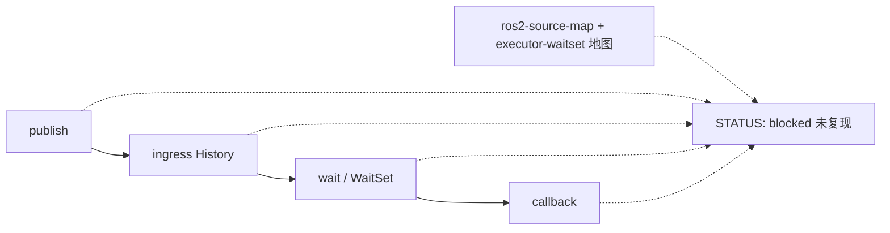

# 三条链复现状态（飞书 wiki3 §13(2)）

Status: **map ≠ reproduce — `STATUS: blocked`。**  
对照飞书《ROS 2 源码闭环》<https://topsunhzj.feishu.cn/wiki/N0Xaw1vsdiXRD4km9Jvc8kHynBf> §13 第 (2) 步：复现 **publish** / **ingress→History** / **wait→callback** 三条链。另两份飞书计划（已在 ADR）：《通信中间件》<https://topsunhzj.feishu.cn/wiki/XKDbw7blLieO4ykCRgLcUCJKnXe>、Cyclone 工业级 fork 研究 <https://topsunhzj.feishu.cn/docx/SrokdQU4DovvdAxutNDcXByMn5e>。

本环境打不开飞书 wiki 正文（登录墙 / 抓取失败）。本页**派生自**已合入 ADR [feishu-middleware-adr.md](feishu-middleware-adr.md)、地图 [ros2-source-map.md](ros2-source-map.md)、WaitSet / callback [feishu-executor-waitset.md](feishu-executor-waitset.md)；**不是**现场摘录，不阻塞等 wiki。

**map ≠ reproduce.** 已有源码地图 **不是**三条链已复现。本自动化主机没有 ROS Humble 运行时，**没有**执行 publish / History / wait→callback 复现。禁止编造时延或 `STATUS: PASS` / `PROVEN`。

**不是** 飞书现场 / 实机 / 跨机根因证明。Not Feishu field proof.

---

## 0. 硬规则

1. **地图 ≠ 复现。** [ros2-source-map.md](ros2-source-map.md) 标路径；[feishu-executor-waitset.md](feishu-executor-waitset.md) 加深 WaitSet → callback。路径存在 ≠ 本机跑过三条链。
2. **本自动化主机：`STATUS: blocked`。** 没有 `/opt/ros/humble`、没有已加载 `librmw_*.so`、没有 Humble `rclcpp` / `rclpy` executor。无 ROS 时 [`scripts/prove_rmw.py`](../../scripts/prove_rmw.py) 打印 `ROS not loaded` — 那是身份闸诚实，**不是**复现 PASS。
3. **不发明分段 µs / 分位数 / PASS / PROVEN。** `publish()` / `rmw_publish()` 返回 `RMW_RET_OK` ≠ 对端已入 History、已 callback。SCOREBOARD 只是 current-best **指针**；本文不抄数字。跨机 UDP 仍 **blocked**。
4. **不改** [`config/fastdds.xml`](../../config/fastdds.xml)、[`docs/artifacts/bench/SCOREBOARD.md`](../artifacts/bench/SCOREBOARD.md)、vendor 源码、`dimos_bridge` 运行时 Python 模块。Agnocast / zenoh / eCAL / DPDK / Isaac / Cega / 自定义 RMW 仍 **Hold**。《3》–《6》仍 Hold。
5. **一次一层。** 本切 = 诚实 blocked 状态 + vanilla 证明脚本。不编译 vendor，不在本机假装复现已跑。

核对地图还在：[`scripts/check_source_map.py`](../../scripts/check_source_map.py)、[`scripts/check_executor_map.py`](../../scripts/check_executor_map.py)。  
核对本页仍写 blocked / map ≠ reproduce：[`scripts/check_three_chain_repro.py`](../../scripts/check_three_chain_repro.py)。

---

## 1. 三条链指哪里（地图，不是本页跑出来的）

飞书 §13(2) 要的是**执行**这三条链。本仓目前只把它们**画出来**：

| 链 | 飞书要复现什么 | 本仓地图（已有） | 本页复现 |
|----|----------------|------------------|----------|
| **publish** | 应用 `publish` → `rmw_publish` → DataWriter / `dds_write_*` | [ros2-source-map.md](ros2-source-map.md) §1 | **未执行** |
| **ingress→History** | 收包入 **Reader History**（早于用户 callback） | [ros2-source-map.md](ros2-source-map.md) §2 | **未执行** |
| **wait→callback** | Humble executor：`rmw_wait` / WaitSet → `rmw_take` → 订阅 callback | [ros2-source-map.md](ros2-source-map.md) §3 · [feishu-executor-waitset.md](feishu-executor-waitset.md) | **未执行** |



双链提醒（混用默认值是 discovery 失败，不是单栈复现失败）：链 A `rmw_fastrtps_cpp` 域 **42**；链 B Cyclone 域 **0**。Humble `rclcpp` / `rclpy` **不在 vendor**。链 B 原生 `DDSTransport` 走 listener，不是 `rclpy` executor。§13(3) 双链基线指针（不重写 XML）：[feishu-dual-chain-baseline.md](feishu-dual-chain-baseline.md)。

---

## 2. 本机为什么 blocked

| 需要 | 本自动化主机 |
|------|----------------|
| Humble underlay `/opt/ros/humble` | **无**（Docker 配方在 [`docker/ros/`](../../docker/ros/)，本切不启） |
| 已加载 RMW `.so` | **无**。`prove_rmw.py` → `ROS not loaded` |
| 发布 / 订阅进程 | **未起** |
| Reader History / WaitSet 观测 | **未做** |
| 飞书现场 / 跨机 UDP | **不是本页。** 跨机仍 blocked |

所以复现状态只能写 **`STATUS: blocked`**。把地图绿（`check_source_map.py` / `check_executor_map.py` exit 0）写成「三条链已复现」= 编造。

---

## 3. Operator recipe（not-run-here）

下面是操作员在**有** Humble 运行时时会跑的最小配方。本自动化主机 **not-run-here**：未 source 链、未起节点、未观测 History / WaitSet、未记录时延。读完配方 **不要**把本页改成 PASS。

```bash
# not-run-here — this automation host has no ROS Humble runtime.
# Do not invent latency or write STATUS: PASS / PROVEN after reading this.

# 0. Identity first (wiki3 §6.3). Import of load.py does not apply env.
#    source config/env/chain_a.sh   # rmw_fastrtps_cpp, domain 42
#    # or: source config/env/chain_b.sh   # rmw_cyclonedds_cpp, domain 0
#    python3 scripts/prove_rmw.py   # need a loaded identifier, not a vendor path

# 1. publish — one Humble publisher on a known topic (same domain).
#    rmw_publish OK is NOT History and NOT callback.

# 2. ingress → History — on the subscriber process, confirm a sample
#    sits in Reader History (Fast-DDS ReaderHistory / Cyclone rhc)
#    BEFORE the user callback. In History ≠ callback ran.

# 3. wait → callback — Humble executor: rmw_wait / WaitSet → rmw_take
#    → subscription callback (see feishu-executor-waitset.md).
#    Chain B native DDSTransport is a listener, not rclpy executor.

# Record only observed hops. Any missing hop: keep STATUS: blocked.
# Do not edit config/fastdds.xml or SCOREBOARD numbers. Do not compile vendor.
```

跑通另开 PR，写实测日志，仍不要改 XML / SCOREBOARD，不要把跨机 UDP 写进本页。

---

## 4. 闸门怎么跑

```bash
python3 scripts/check_three_chain_repro.py
```

无 ROS 时应 exit 0，并打印 `three-chain repro: blocked (map only)`。脚本只读本页 + 地图文件是否还在：必须保留 **map ≠ reproduce**、**`STATUS: blocked`**、publish / History / wait→callback（或 WaitSet / callback），且不得把复现写成 PASS / PROVEN。CI 登记见 [ci-cd-gates.md](ci-cd-gates.md)。**不要**为了本地绿去编译 vendor 或假装复现已跑。

---

## 5. 引用

飞书（查阅 2026-09-12；本环境未取到 wiki 正文，本仓按已合入 ADR / 源码地图落地）：

1. 《ROS 2 源码闭环》§13(2) publish / History / wait→callback：<https://topsunhzj.feishu.cn/wiki/N0Xaw1vsdiXRD4km9Jvc8kHynBf>
2. 《通信中间件》：<https://topsunhzj.feishu.cn/wiki/XKDbw7blLieO4ykCRgLcUCJKnXe>
3. Cyclone 工业级 fork 研究：<https://topsunhzj.feishu.cn/docx/SrokdQU4DovvdAxutNDcXByMn5e>

本仓：

4. [feishu-middleware-adr.md](feishu-middleware-adr.md)
5. [ros2-source-map.md](ros2-source-map.md) — publish / ingress→History / wait→callback 地图
6. [feishu-executor-waitset.md](feishu-executor-waitset.md) — WaitSet → callback 身份地图
7. [feishu-runtime-provenance.md](feishu-runtime-provenance.md) — Humble underlay ≠ vendor snapshot
8. [ci-cd-gates.md](ci-cd-gates.md)
9. [feishu-dual-chain-baseline.md](feishu-dual-chain-baseline.md) — wiki3 §13(3) FastDDS + Cyclone 基线指针（不重写 XML）
10. [scripts/check_three_chain_repro.py](../../scripts/check_three_chain_repro.py) · [scripts/check_dual_chain_baseline.py](../../scripts/check_dual_chain_baseline.py) · [scripts/check_source_map.py](../../scripts/check_source_map.py) · [scripts/check_executor_map.py](../../scripts/check_executor_map.py) · [scripts/prove_rmw.py](../../scripts/prove_rmw.py)
