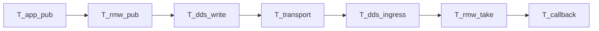

# 时延归因方法（飞书 wiki3 §12 / §13.3 → 本仓双链）

Status: **方法文档 — 不发明数字、不重写 SCOREBOARD。**  
对照飞书《ROS 2 源码闭环》<https://topsunhzj.feishu.cn/wiki/N0Xaw1vsdiXRD4km9Jvc8kHynBf> §12（分段公式 / 矩阵 / DoD）与 §13 第 (3) 步（FastDDS + Cyclone 基线）。决策见 [feishu-middleware-adr.md](feishu-middleware-adr.md)。双链契约见 [ros2-dds-r0-interface-freeze.md](ros2-dds-r0-interface-freeze.md)。链路文件见 [ros2-source-map.md](ros2-source-map.md)。中日公开旋钮只对照、不落地：[cn-jp-ros2-absorb.md](cn-jp-ros2-absorb.md)。

本仓**怎么归因**，不是现场测出的根因。当前最佳指针（iter7 XML 种子 + 已记账 same-host 表）只看 [`docs/artifacts/bench/SCOREBOARD.md`](../artifacts/bench/SCOREBOARD.md) — **不要**把那边的分位数抄进本文当新结论。

**不是** 飞书现场 / 实机 / 跨机根因证明。Not Feishu field proof.

---

## 0. 硬规则（§12.1 + 本仓 Hold）

1. **端到端必须分段看。** wiki3 §12.1：`T_e2e` 拆成阶段，用来定位卡在哪一层。
2. **禁止把各段 P99 相加当成端到端 P99。** 分位数不可加。`P99(T_e2e)` 只能从**同一组端到端样本**算；`P99(A)+P99(B)+…` 不是 `P99(A+B+…)`。
3. **同机分位数 ≠ 现场证明。** `same-process` / `same-host` 不能代替飞书现场、实机、或跨机 UDP。
4. **跨机 UDP 仍 blocked。** 单机 / 无第二台时写 `STATUS: blocked`，禁止填假分位数。见 [`2026-09-11-cross-host/`](../artifacts/bench/2026-09-11-cross-host/README.md)。
5. **频率与尺寸是产品定义的**（§12.2–12.4），不是 Fast-DDS / Cyclone 默认值。本仓已预订的产品用例写在 [`scripts/bench/README.md`](../../scripts/bench/README.md)；本文不重报 Hz / 字节 / µs。
6. **不改** [`config/fastdds.xml`](../../config/fastdds.xml)（iter7 种子）、SCOREBOARD 已记账数字、vendor 源码、`dimos_bridge` 运行时模块。Agnocast / zenoh / eCAL / DPDK / Isaac / Cega 仍 **Hold**。《3》–《6》仍 Hold。

核对「加载了哪个 RMW」：[`scripts/prove_rmw.py`](../../scripts/prove_rmw.py)（§6.3，身份闸，**不是**时延）。  
核对本仓源码地图还在：[`scripts/check_source_map.py`](../../scripts/check_source_map.py)（§13.2，身份闸，**不是**时延）。  
核对 WaitSet → callback 地图还在：[`scripts/check_executor_map.py`](../../scripts/check_executor_map.py)（§13 wait→callback，身份闸，**不是**时延）。  
核对 bench 指针 / STATUS 还在：[`scripts/print_bench_gates.py`](../../scripts/print_bench_gates.py)（本文配套，只读，**不发明数字**）。

---

## 1. wiki3 §12.1 公式 × 双链

飞书要求把端到端拆段。映射到本仓两条**独立**栈（不共享域 / RMW / QoS，除非操作员显式对齐）：

| 链 | 角色 | 契约 |
|----|------|------|
| **A** | 导航 FastDDS | `rmw_fastrtps_cpp`，`ROS_DOMAIN_ID=42`，[`config/fastdds.xml`](../../config/fastdds.xml) |
| **B** | DimOS 原生 Cyclone | 域 **0**；ROS 侧名 `rmw_cyclonedds_cpp`。不要 `source chain_a.sh` |

分段（方法；**不是**本仓已测出的各段 µs）：

```
T_e2e = T_app_pub + T_rmw_pub + T_dds_write + T_transport + T_dds_ingress + T_rmw_take + T_callback
```

| 段 | wiki3 阶段 | 链 A（域 42 / Fast-DDS） | 链 B（域 0 / Cyclone） | 本仓今天怎么对上 |
|----|------------|-------------------------|------------------------|------------------|
| `T_app_pub` | 应用 publish（含序列化） | `rclpy` / `ROSTransport`（Humble 发行版，**不在** `vendor/`） | 原生 `DDSTransport` 或 ROS 客户端 | 源码地图只标到 RMW；无单独计时 |
| `T_rmw_pub` | RMW write | [`rmw_publish.cpp`](../../vendor/rmw_fastrtps/rmw_fastrtps_cpp/src/rmw_publish.cpp) → shared `__rmw_publish` | [`rmw_node.cpp`](../../vendor/rmw_cyclonedds/rmw_cyclonedds_cpp/src/rmw_node.cpp) `rmw_publish` | [源码地图 §1](ros2-source-map.md)；`publish()` 返回 ≠ 对端已送达 |
| `T_dds_write` | Writer History / send | `DataWriterHistory` / `WriterHistory` | `dds_write_*` → `ddsi_whc_insert` | 同上。符号闸：`check_source_map.py` |
| `T_transport` | 网 / 本机投递 | builtin UDP + 隐式 SHM（iter7 种子，**不改 XML**） | Cyclone 默认；**不**设 `CYCLONEDDS_URI` | 拓扑标签：`same-process` / `same-host` / `cross-host-UDP`。跨机 **blocked** |
| `T_dds_ingress` | ingress → Reader History | `StatefulReader` → `ReaderHistory` | `ddsi_rhc` / `dds_rhc` | [源码地图 §2](ros2-source-map.md)。入 History ≠ callback 已跑 |
| `T_rmw_take` | `rmw_wait` / `rmw_take` | shared `rmw_wait.cpp` / `rmw_take.cpp` | `rmw_node.cpp` → `dds_waitset` / `dds_take` | [源码地图 §3](ros2-source-map.md)；加深：[Executor / WaitSet](feishu-executor-waitset.md) |
| `T_callback` | Executor / 用户回调 | Humble `rclcpp` / `rclpy`（**不在** vendor） | ROS 侧同左；原生链 B 不走 ROS executor | 本仓不 vendor `rcl*`；见 WaitSet 专页 |



**禁止：** `P99(T_e2e) := Σ P99(段)`。  
**禁止：** 把 `same-process` P99、`same-host` P99、（blocked 的）`cross-host-UDP` 加在一起。  
**禁止：** 链 A 与链 B 进同一张对照表。混用默认值是 **discovery 失败**，不是单栈时延。

本仓 CI **不**给各段打时间戳。可复现入口 [`scripts/bench/pingpong.py`](../../scripts/bench/pingpong.py) 只记**一个**量：同一链 × 同一拓扑 × 同一尺寸的 ping-pong **RTT**（request → echo → reply）p50 / p95 / p99。那是闭环往返，**不是**飞书现场单向 `T_e2e`，也**不是**上表七段之和。上游 `pytest -m tool -k dds` 的 Latency 列是 drain time，**不是** per-message 分位。

---

## 2. §12.2–12.4 矩阵与 DoD（产品定义，不编频率）

wiki3 要测试矩阵 + 完成定义；**Hz / 包长由产品定**，不要把中间件默认值写进矩阵当 SLA。

本仓矩阵的**形状**（数字去 SCOREBOARD / 各次 `docs/artifacts/bench/<date>/`，本文不抄）：

| 维 | 本仓怎么切 | 不要做什么 |
|----|------------|------------|
| 链 | A 与 B **分目录、分表** | 一张 A-vs-B 对照表 |
| 拓扑 | 每个 run **只标一个**：`same-process` / `same-host` / `cross-host-UDP` | 混拓扑；把同机当成跨机 |
| 产品用例 | bench README 里的预订入口（大包 / IMU 高频小包等） | 把发行版默认 Hz 当产品频率 |
| QoS | `testdata.py` 的 `high_throughput` / `reliable` 名 | 当成 R0 导航冻结 QoS |
| 缺件 | `STATUS: blocked` + 缺什么 | 填假 p50 / p95 / p99 |

DoD（本仓已落地的可核对项，不是现场验收）：

- 一次 run：`summary.md` + `raw.json` + `environment.md`（见 [benchmark-dds.md](../usage/benchmark-dds.md)）。
- 日期目录挂在 [`docs/artifacts/bench/README.md`](../artifacts/bench/README.md)。
- **current best 只认** [`SCOREBOARD.md`](../artifacts/bench/SCOREBOARD.md)（iter7 种子；iter10 Path B 记分板）。本文与 CI **不**改那页数字。
- 跨机 UDP：配方 [`scripts/bench/run_cross_host_a.sh`](../../scripts/bench/run_cross_host_a.sh)；单机必须 blocked。
- 身份先于归因：先 `prove_rmw.py`（加载了谁）和 `check_source_map.py`（地图还在），再谈「是 Fast-DDS / Cyclone 的问题」。vendor SHA **不能**当根因。

---

## 3. §13 第 (3) 步：基线已在本仓，本切不重测

ADR 已写：§13 (3) FastDDS + Cyclone 基线「双链契约已在；bench 产物另册；不重写 XML、不改 SCOREBOARD」。专页：[feishu-dual-chain-baseline.md](feishu-dual-chain-baseline.md)（SCOREBOARD **pointer only**；same-topology XML tuning is paused）。本文只**指过去**，不重跑、不重记账。

| 指针 | 路径 |
|------|------|
| 当前最佳配置 + 已记账 same-host 表 | [`docs/artifacts/bench/SCOREBOARD.md`](../artifacts/bench/SCOREBOARD.md) |
| 历次日期索引 | [`docs/artifacts/bench/README.md`](../artifacts/bench/README.md) |
| 怎么跑 | [`scripts/bench/README.md`](../../scripts/bench/README.md)、[`docs/usage/benchmark-dds.md`](../usage/benchmark-dds.md) |
| 跨机 UDP（blocked） | [`2026-09-11-cross-host/`](../artifacts/bench/2026-09-11-cross-host/README.md) |
| XML 种子（只读） | [`config/fastdds.xml`](../../config/fastdds.xml)（iter7） |

`print_bench_gates.py` 只报告这些指针是否还在、STATUS 是否仍写 blocked。它**不**读取、不打印、不重算任何分位数。

---

## 4. 闸门怎么跑

```bash
python3 scripts/print_bench_gates.py
python3 scripts/prove_rmw.py
python3 scripts/check_source_map.py
python3 scripts/check_executor_map.py
```

无 ROS 时三个脚本都应能 exit 0（缺必填文件则 `print_bench_gates.py` exit 1）。CI 登记见 [ci-cd-gates.md](ci-cd-gates.md)。**不要**为了本地绿去编译 vendor。

---

## 5. 引用

飞书（查阅 2026-09-12；wiki 正文需登录，本仓按 §12 / §13 可执行条款落地）：

1. 《ROS 2 源码闭环》§12 / §13：<https://topsunhzj.feishu.cn/wiki/N0Xaw1vsdiXRD4km9Jvc8kHynBf>

本仓：

2. [ros2-dds-r0-interface-freeze.md](ros2-dds-r0-interface-freeze.md)
3. [feishu-middleware-adr.md](feishu-middleware-adr.md)
4. [ros2-source-map.md](ros2-source-map.md)
5. [cn-jp-ros2-absorb.md](cn-jp-ros2-absorb.md)
6. [docs/artifacts/bench/SCOREBOARD.md](../artifacts/bench/SCOREBOARD.md)
7. [scripts/prove_rmw.py](../../scripts/prove_rmw.py) · [scripts/check_source_map.py](../../scripts/check_source_map.py) · [scripts/print_bench_gates.py](../../scripts/print_bench_gates.py) · [scripts/check_executor_map.py](../../scripts/check_executor_map.py)
8. [feishu-executor-waitset.md](feishu-executor-waitset.md)
