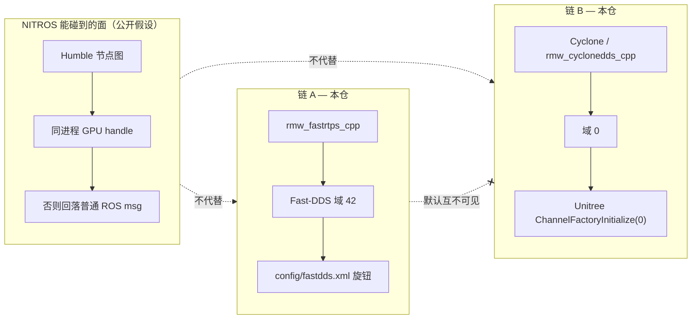

# NITROS 与本仓双链 DDS（对照说明）

Status: **文档对照 — 不落地 Isaac。** Vendor Isaac / `isaac_ros_nitros` = **Hold**。  
本文只对照**公开** NVIDIA Isaac NITROS 与本仓已冻结的双链 DDS，不改中间件、不编造时延、不把 NITROS 当成跨机或跨域的替代方案。

本仓契约仍是两条独立栈：[R0 接口冻结](ros2-dds-r0-interface-freeze.md)。链 A Fast-DDS 域 **42**，链 B Cyclone 域 **0**。`config/fastdds.xml`、SCOREBOARD、`vendor/` **不在本文范围内改动**。

---

## 1. 两套东西，不要叠成一张「加速」叙事

| | 公开 Isaac NITROS | 本仓双链 DDS |
|--|------------------|--------------|
| 解决什么 | 同一进程里，CPU↔加速器（GPU 等）之间少拷大图 / 点云 / tensor | 导航 Fast-DDS 与 DimOS/Unitree Cyclone **互不发现**（除非操作员显式对齐） |
| 层 | Humble `rclcpp` 类型适配 / 协商（节点图内部） | RMW + DDS 参与者、域、QoS、XML 旋钮 |
| 零拷贝成立条件 | **同进程** NITROS 节点相邻；传 GPU handle，不是整包 CPU 拷 | 本仓未实现、也未承诺 GPU 零拷贝；same-process bench 仍是普通 ROS / Cyclone 消息 |
| 对不上时 | 回落到普通 ROS 消息（`sensor_msgs/Image` 等），非 NITROS 节点仍能订 | 域 42 与域 0 **发现失败**，不是「自动转成另一条链」 |
| 本仓动作 | **Hold**：不 vendor Isaac GEM / NITROS 树 | 已落地：`vendor/` 公开栈拷贝 + `config/env/` + 契约种子 XML |

NITROS 不是第二条 DDS，也不是 Fast-DDS XML 的替代品。双链也不是 NITROS 的「本仓实现」。

---

## 2. 公开 NITROS 是什么（Humble + REP）

NVIDIA Isaac Transport for ROS（NITROS）是 ROS 2 **Humble** 引入的硬件加速能力在 Isaac 侧的实现：[Isaac ROS NITROS 概念页](https://nvidia-isaac-ros.github.io/concepts/nitros/index.html)。它叠在两份已定稿 REP 上：

| 能力 | 规范 | 公开要点 |
|------|------|----------|
| Type adaptation（类型适配） | [REP-2007](https://github.com/ros-infrastructure/rep/blob/master/rep-2007.rst) | 节点用更贴加速器的 **custom type**；需要出网或对接普通节点时再转成 ROS 消息。Humble `rclcpp` 已提供 `TypeAdapter`（[Humble 发行说明](https://docs.ros.org/en/humble/Releases/Release-Humble-Hawksbill.html)）。 |
| Type negotiation（类型协商） | [REP-2009](https://www.ros.org/reps/rep-2009.html) | 相邻节点广告自己会的类型；框架选性能更好的格式。适配类型**不直接上线**；上线的仍是 ROS 消息。不支持协商的旧节点保持兼容。 |

NVIDIA 自己的表述（概念页 + [CUDA with NITROS](https://nvidia-isaac-ros.github.io/concepts/nitros/cuda_with_nitros.html) + [开发者博客](https://developer.nvidia.com/blog/boosting-custom-ros-graphs-using-nvidia-isaac-transport-for-ros/)）：

- 图里两个 NITROS 节点挨着时，先协商，再用适配类型传 **GPU 侧 handle**，避免 CPU↔加速器来回拷。
- **系统假设：要吃到 NITROS 零拷贝，相关节点必须跑在同一进程。**
- 每个 NITROS 类型与一种 ROS 消息 **一对一**（例如 `NitrosImage` ↔ `sensor_msgs/Image`，`NitrosPointCloud` ↔ `sensor_msgs/PointCloud2`）。
- 和非 NITROS 节点（RViz、普通 Humble 订阅者）通信时，**自动回落**为对应的普通 ROS 消息；该节点表现得像普通 ROS 2 节点。
- CUDA 节点可用 Managed NITROS Publisher / Subscriber 直接交 GPU buffer；对不认 NITROS 的订阅者，同一份数据仍以普通消息发出。

公开入口（源码树，**不要**拷进本仓 `vendor/`）：[NVIDIA-ISAAC-ROS/isaac_ros_nitros](https://github.com/NVIDIA-ISAAC-ROS/isaac_ros_nitros)。入门综述：[What is NITROS](https://docs.nvidia.com/learning/physical-ai/getting-started-with-isaac-ros/latest/an-introduction-to-ai-based-robot-development-with-isaac-ros/05-what-is-nitros.html)。

---

## 3. 本仓双链是什么（域 42 / 域 0）

冻结表把工作拆成**两条栈**，不共享域、RMW、QoS，除非操作员显式对齐。混用默认值是 **discovery 失败**，不是单栈时延 bug。

| 链 | 实现 | 域 | 本仓落点 |
|----|------|----|----------|
| A — nav FastDDS | ROS 2 RMW `rmw_fastrtps_cpp` | **42** | [`config/env/chain_a.sh`](../../config/env/chain_a.sh)、[`config/fastdds.xml`](../../config/fastdds.xml)（契约种子，不是 DimOS main 抽出） |
| B — DimOS Cyclone | 原生 Cyclone；ROS 侧名 `rmw_cyclonedds_cpp` | **0** | [`config/env/chain_b.sh`](../../config/env/chain_b.sh)、`dimos_bridge` 里 `DDSConfig.domain_id` / Unitree `ChannelFactoryInitialize(0)` |

跨机 UDP、same-host、same-process 是 **bench 拓扑标签**，见 [benchmark-dds.md](../usage/benchmark-dds.md)。单机上 `cross-host-UDP` 必须标 blocked，禁止填假分位数。数字不是飞书现场 / 实机根因。

---

## 4. NITROS **能**帮什么

只谈公开文档写明的范围：**同一进程内**、已经（或将要）走 Humble 类型适配/协商的 **CPU↔加速器** 图。

1. **少拷大缓冲。** 相机 / 点云 / DNN tensor 若下一跳也是 NITROS（或 Managed CUDA）节点，可以传 GPU handle，而不是先 `cudaMemcpy` 回 CPU、再按 `sensor_msgs` 序列化、再拷回 GPU。
2. **节点仍用加速器友好的类型。** REP-2007 让 publisher/subscription 直接拿 custom type（Isaac 侧即 `Nitros*`）；需要兼容时再 `convert_to_ros_message`。
3. **图内自动选格式。** REP-2009 让会 NITROS 的邻居选适配类型；不会的邻居继续收普通 ROS 消息。不必为了 RViz 拆开整条加速图。
4. **自定义 CUDA 节点可接入 Isaac GEM。** Managed NITROS pub/sub 把自研预处理 / 后处理接到 TensorRT 等节点，仍保持对非 NITROS 订阅者的普通消息出口。

这些都停在 **Humble 节点图 + 同进程加速器内存**。它们不改 `ROS_DOMAIN_ID`，也不读 `FASTRTPS_DEFAULT_PROFILES_FILE`。

---

## 5. NITROS **不能**帮什么（对本仓尤其重要）

| 本仓真实问题 | 为何 NITROS 覆盖不到 |
|--------------|----------------------|
| **跨机 UDP** | 类型适配类型「从不直接上网」（REP-2009）。出进程 / 出主机仍是普通 ROS 消息 + RMW/DDS 序列化。Isaac 概念页把零拷贝限定在**同进程**。本仓跨机配方是链 A Fast-DDS 域 42 的 UDP ping-pong，与 GPU handle 无关。 |
| **域隔离（42 vs 0）** | NITROS 活在 **一条** ROS 图、通常 **一个** `ROS_DOMAIN_ID` 里。它不会让 Fast-DDS 42 与 Cyclone 0 互相发现，也不会把链 B Unitree 参与者拉进链 A。对不上域仍然是 discovery 失败。 |
| **Fast-DDS XML 旋钮** | `historyQos`、UDP socket buffer、`send_buffers`、中包 SHM `maxMessageSize` / `healthy_check_timeout_ms` 等是 **eProsima participant/transport** 配置，本仓种子在 [`config/fastdds.xml`](../../config/fastdds.xml)。NITROS 不提供、也不替代这些旋钮。不要为了「上 NITROS」去改这份 XML。 |
| **双链混用误诊** | 「Foxglove / Nav2 在 42、Unitree 在 0」不是 CPU↔GPU 拷贝问题。NITROS 不能当跨 RMW 网桥。 |
| **跨进程 / 跨容器同机** | 官方零拷贝假设是 **same process**。两个 container、两个 `ros2 run`，即使同 host、同域 42，也不是概念页里的 NITROS 零拷贝路径。 |
| **本仓 bench 分数** | same-process / same-host 分位数测的是普通消息 RTT。没有 NITROS 节点图，不能把 Isaac 宣传数字写进 SCOREBOARD。 |

补充：Isaac 还有 NITROS bridge（ROS 1 ↔ Humble、走 GPU 少拷），那是 **跨 ROS 发行版** 的桥，不是本仓链 A↔链 B，也不是跨主机 UDP 基线。

---

## 6. 决策：Vendor Isaac = Hold

| 项 | 状态 | 原因 |
|----|------|------|
| 对照文档（本文） | **允许** | 只引用公开页与本仓已有契约 |
| 把 `isaac_ros_nitros` / Isaac GEM 拷进 `vendor/` | **Hold** | 本仓 vendor 只收公开 RMW / Fast-DDS / Cyclone；Isaac 是另一套许可与二进制/CUDA 依赖 |
| 改 `fastdds.xml` / SCOREBOARD / 中间件补丁 | **禁止（本文）** | 与 NITROS 对照无关；XML 旋钮与记分板保持现网契约 |
| 用 NITROS 解释跨机 blocked 或域 42/0 | **禁止** | 类别错误 |
| 合并进 `topsun_dimos` 或把 Isaac 当第三条链 | **禁止** | 本仓不往 DimOS 开 PR；双链契约不因对照文改变 |

以后若要评估 NITROS，应另开文档/分支：Humble 同进程相机或 DNN 图、明确 GPU、**不**动双链域与 XML。在那之前不要把 Isaac 树推进 `vendor/`。

---

## 7. 公开引用

只列本文用过的公开链接（查阅日期按仓库工作日 2026-09-11）：

1. NVIDIA Isaac ROS — *NITROS*：<https://nvidia-isaac-ros.github.io/concepts/nitros/index.html>  
   同进程零拷贝假设、与非 NITROS 节点兼容、类型对照表。
2. NVIDIA Isaac ROS — *CUDA with NITROS*：<https://nvidia-isaac-ros.github.io/concepts/nitros/cuda_with_nitros.html>  
   Managed publisher/subscriber；对普通订阅者仍发 ROS 消息。
3. NVIDIA Learning — *What is NITROS*：<https://docs.nvidia.com/learning/physical-ai/getting-started-with-isaac-ros/latest/an-introduction-to-ai-based-robot-development-with-isaac-ros/05-what-is-nitros.html>
4. NVIDIA Technical Blog — *Boosting Custom ROS Graphs Using NVIDIA Isaac Transport for ROS*（2023-11-17）：<https://developer.nvidia.com/blog/boosting-custom-ros-graphs-using-nvidia-isaac-transport-for-ros/>
5. REP-2007 *Type Adaptation Feature*（Final）：<https://github.com/ros-infrastructure/rep/blob/master/rep-2007.rst>
6. REP-2009 *Type Negotiation Feature*：<https://www.ros.org/reps/rep-2009.html>  
   适配类型不上网；与旧节点兼容。
7. ROS 2 Humble 发行说明（Type Adaptation）：<https://docs.ros.org/en/humble/Releases/Release-Humble-Hawksbill.html>
8. 源码树（Hold，勿 vendor）：<https://github.com/NVIDIA-ISAAC-ROS/isaac_ros_nitros>
9. 本仓双链冻结：[ros2-dds-r0-interface-freeze.md](ros2-dds-r0-interface-freeze.md)

HTML 镜像（若站点可访问）：<https://www.ros.org/reps/rep-2007.html>。
