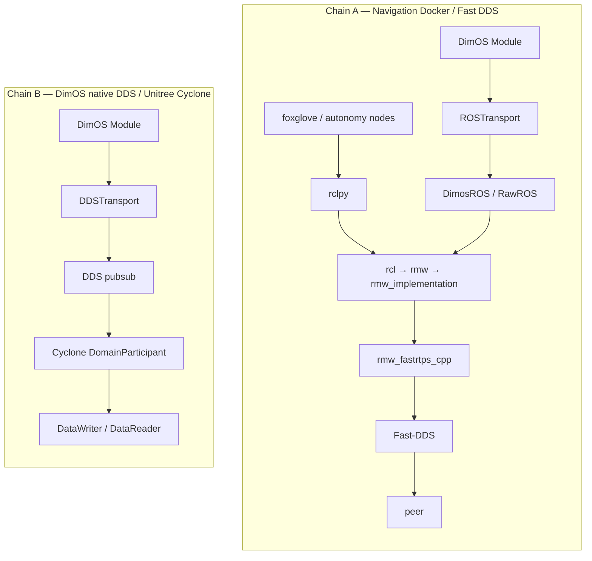

# ROS 2 / DDS R0 interface freeze

> **Repo note.** This copy lives in independent repo [`topsun-bot/ros2_hzj`](https://github.com/topsun-bot/ros2_hzj), not in `topsun_dimos`. Frozen tables, domain IDs, QoS, and the dual-chain contract are unchanged.
>
> **R1 path update.** Public RMW / Fast-DDS trees are now vendored as plain copies under [`vendor/`](../../vendor/) (see [`vendor/VERSIONS.md`](../../vendor/VERSIONS.md)). DimOS dual-chain files are whole-file copies under [`dimos_bridge/`](../../dimos_bridge/) (relative paths preserved; source SHA in [`dimos_bridge/SOURCE.md`](../../dimos_bridge/SOURCE.md)). Chain A `fastdds.xml` lives at [`config/fastdds.xml`](../../config/fastdds.xml) as a **contract seed** — `topsun_dimos` `main` still has no `fastdds.xml` / `docker/navigation/`. Paths that still say `dimos/` without the `dimos_bridge/` prefix refer to the DimOS monorepo, not a claim that the whole monorepo is here.
>
> **R2 path update (Cyclone vendor + R1–R5 structure).** Chain B public trees are also plain copies: [`vendor/rmw_cyclonedds`](../../vendor/rmw_cyclonedds/) and [`vendor/CycloneDDS`](../../vendor/CycloneDDS/). Structural extracts (env helpers, XML seed, Dockerfile split, topic constants, bench howto) live under [`config/env/`](../../config/env/), [`config/fastdds.zh.md`](../../config/fastdds.zh.md), [`docker/ros/`](../../docker/ros/), [`dimos_bridge/dimos/protocol/dds_topics.py`](../../dimos_bridge/dimos/protocol/dds_topics.py), [`docs/usage/benchmark-dds.md`](../usage/benchmark-dds.md). Copied DimOS modules are **behavior-unchanged**. Vendoring Cyclone is **not** a latency root-cause claim.

Status: **R0 approved — documentation only.** This file freezes the dual-chain map and the behavior-unchanged interface subset. Frozen tables (domains, topics, QoS) are unchanged. Structural helpers do not silently rewrite DimOS runtime defaults.

LCM is the default DimOS transport on Linux (`GlobalConfig.default_transport` in `topsun_dimos` `dimos/core/global_config.py`). **LCM is out of scope for this DDS refactor.** Do not treat LCM paths as in-scope work, latency root cause, or behavior-unchanged surface.

R1–R5 **structure** (env extract, `fastdds.xml` seed, Dockerfile split, topic constants, bench docs) is landed in this repo without changing copied-module behavior. Middleware behavior patches, vendor builds, and eval / latency **numbers** remain **Hold**.

---

## 1. Dual-chain map (two separate chains)

These are **two stacks**, not one. They do not share a domain, RMW implementation, or QoS profile unless an operator explicitly aligns them. Mixing their defaults is a discovery failure, not a single-stack latency bug.



### Chain A — Navigation Docker / Fast DDS

Intended flow:

1. Foxglove / autonomy nodes
2. `rclpy` (including nav-image relays such as `twist_relay.py` and `goal_autonomy_relay.py` when that image exists)
3. `rcl` → `rmw` → `rmw_implementation`
4. `rmw_fastrtps_cpp`
5. Fast-DDS, historically configured with `FASTRTPS_DEFAULT_PROFILES_FILE=/ros2_ws/config/fastdds.xml`
6. Peer

DimOS bridge onto the same RMW stack (verified in `topsun_dimos`):

1. Module stream
2. `ROSTransport` (`dimos/core/transport.py`)
3. `DimosROS` / `RawROS` (`dimos/protocol/pubsub/impl/rospubsub.py`)
4. Same ROS 2 RMW stack as the rest of Chain A (`rclpy` → `rcl` → `rmw` → `rmw_implementation` → Fast-DDS when that RMW is selected)

Cited R0 evidence (not present on current `topsun_dimos` `main`; see [Live-tree drift](#live-tree-drift)):

- `docker/navigation/Dockerfile` and `docker-compose.yml` set `RMW_IMPLEMENTATION=rmw_fastrtps_cpp`
- `ROS_DOMAIN_ID` default **42**
- Relays at `docker/navigation/foxglove_utility/twist_relay.py` and `goal_autonomy_relay.py`

Live-tree ROS Docker that *does* exist in `topsun_dimos`: `docker/ros/Dockerfile` installs ROS 2 Humble (`ROS_DISTRO=humble`) plus `foxglove-bridge`, `joy`, `teleop-twist-joy`, and Nav2 packages. It does **not** set `RMW_IMPLEMENTATION`, `ROS_DOMAIN_ID`, or `FASTRTPS_DEFAULT_PROFILES_FILE`. Humble's distro default RMW is Fast DDS (`rmw_fastrtps_cpp`); that is a ROS distro fact, not a value encoded in `topsun_dimos` or in this repository.

This repo (`ros2_hzj`) vendors public ROS 2 / rmw / Fast-DDS **and** CycloneDDS / `rmw_cyclonedds` as **plain directory copies** under `vendor/` (see [`vendor/VERSIONS.md`](../../vendor/VERSIONS.md)). It still does **not** invent a custom RMW. Use distro or in-tree `rmw_fastrtps_cpp` for Chain A and `rmw_cyclonedds_cpp` / native Cyclone for Chain B. Vendoring a tree is not a measured latency result.

### Chain B — DimOS native DDS / Unitree Cyclone

Verified flow in `topsun_dimos`:

1. Module stream
2. `DDSTransport` (`dimos/core/transport.py`, gated on `DDS_AVAILABLE`)
3. `DDS` (`dimos/protocol/pubsub/impl/ddspubsub.py`)
4. Cyclone `DomainParticipant` via `DDSService` / `DDSConfig.domain_id` default **`0`** (`dimos/protocol/service/ddsservice.py`)
5. `DataWriter` / `DataReader`

Unitree interop note (research / compatibility, **not** a measured latency root cause):

- Unitree SDK2 paths call `ChannelFactoryInitialize(0)` (domain 0) and historically expect Cyclone / `rmw_cyclonedds_cpp`.
- Evidence in `topsun_dimos`: `dimos/hardware/drive_trains/unitree_go2/adapter.py` (`ChannelFactoryInitialize(0)` — "default domain, default NIC"), `dimos/robot/unitree/g1/effectors/high_level/dds_sdk.py`, `dimos/hardware/drive_trains/unitree_go2/README.md`.
- Do not cite this Cyclone expectation as proof that Chain A Fast-DDS latency is "the" problem.

Default DimOS transport remains **LCM** (Linux) or **SHM** (Darwin). Both are **out of scope** for this refactor.

### Hard pitfall: domain 42 vs domain 0

| Chain | Implementation | Default domain in the R0 freeze | What `topsun_dimos` encodes today |
|-------|----------------|----------------------------------|-----------------------------------|
| A — nav Fast DDS | ROS 2 RMW / Fast-DDS | **42** | No `ROS_DOMAIN_ID` assignment found. Unset ROS 2 `ROS_DOMAIN_ID` is **0**. |
| B — native Cyclone | `DDSConfig.domain_id` / Unitree `ChannelFactoryInitialize(0)` | **0** | **0** (`DDSConfig.domain_id = 0`) |

Participants on 42 and 0 will not discover each other. Aligning domains is an R1+ / operator concern. R0 does not change either default.

---

## 2. Frozen interface subset

**Behavior-unchanged applies only to the rows below.** Topics not listed here are **not** covered by any behavior-unchanged promise until a full `ros2 topic list` freeze.

QoS in this table is the R0 contract for the navigation Fast-DDS path (Chain A). It is **not** the `DimosROS` / `RawROS` library default in `topsun_dimos` `dimos/protocol/pubsub/impl/rospubsub.py` (that default is `RELIABLE`, `KEEP_LAST`, `VOLATILE`, `depth=5000`). Do not treat the library default as nav-path QoS.

| Surface | Type / binding | QoS / notes (R0 contract) |
|---------|----------------|---------------------------|
| Discovery domain (nav path) | ROS 2 `ROS_DOMAIN_ID` | **42** |
| `/foxglove_teleop` → `/cmd_vel` | `geometry_msgs/Twist` → `geometry_msgs/TwistStamped` | `BEST_EFFORT`, `KEEP_LAST`, `depth=1` |
| `/goal_pose` | `geometry_msgs/PoseStamped` | `RELIABLE`, `VOLATILE`, `KEEP_LAST`, `depth=5` |
| `/way_point` | `geometry_msgs/PointStamped` | `RELIABLE`, `VOLATILE`, `KEEP_LAST`, `depth=5` |
| `/joy` | `sensor_msgs/Joy` | Topic frozen; QoS not specified in this subset |
| Go2 ROS bridge `lidar` | `sensor_msgs/PointCloud2` via `ROSTransport("lidar", PointCloud2)` | Binding frozen in `unitree_go2_ros.py` |
| Go2 ROS bridge `global_map` | `sensor_msgs/PointCloud2` via `ROSTransport("global_map", PointCloud2)` | Same |
| Go2 ROS bridge `odom` | `geometry_msgs/PoseStamped` via `ROSTransport("odom", PoseStamped)` | Same |
| Go2 ROS bridge `color_image` | `sensor_msgs/Image` via `ROSTransport("color_image", Image)` | Same |

Go2 ROS bindings (verified in `topsun_dimos`):

```python
# dimos/robot/unitree/go2/blueprints/smart/unitree_go2_ros.py
("lidar", PointCloud2): ROSTransport("lidar", PointCloud2),
("global_map", PointCloud2): ROSTransport("global_map", PointCloud2),
("odom", PoseStamped): ROSTransport("odom", PoseStamped),
("color_image", Image): ROSTransport("color_image", Image),
```

---

## 3. Reproducible latency command (hypothesis until percentiles exist)

This measures **Chain B** (native Cyclone `DDS` pubsub), not Chain A Fast-DDS.

The command below is a **`topsun_dimos` tree recipe**. This repo now has the benchmark **sources** under `dimos_bridge/` plus a howto at [`docs/usage/benchmark-dds.md`](../usage/benchmark-dds.md). Full DimOS extras are still required; this repo does **not** record percentile scores. Eval / latency **numbers** remain **Hold**.

```bash
cd <topsun_dimos> && uv sync --extra dds
uv run pytest dimos/protocol/pubsub/benchmark/test_benchmark.py -m tool -k dds -v
```

The `-k dds` filter selects the Cyclone cases in `dimos/protocol/pubsub/benchmark/testdata.py` (`dds_high_throughput_pubsub_channel`, `dds_reliable_pubsub_channel`). Pytest default `addopts` exclude the `tool` marker, so `-m tool` is required.

Treat output as a **hypothesis**, not a root cause, until p50 / p95 / p99 are recorded.

The nav Fast-DDS path (Chain A) needs a **separate same-domain-42 application ping-pong**. Do not compare this benchmark to Foxglove / autonomy / `ROSTransport` latency until that measurement exists.

---

## 4. Gates / non-goals

| Item | R0 status |
|------|-----------|
| Env extract (`RMW_IMPLEMENTATION`, `ROS_DOMAIN_ID`, `FASTRTPS_DEFAULT_PROFILES_FILE`) | **Structure landed** at [`config/env/`](../../config/env/) (explicit source/apply only; DimOS defaults unchanged). |
| Externalize `fastdds.xml` | **Contract seed** at [`config/fastdds.xml`](../../config/fastdds.xml) + [`config/fastdds.zh.md`](../../config/fastdds.zh.md) (not extracted from DimOS main). |
| Dockerfile split / nav-image changes | **Split landed** at [`docker/ros/`](../../docker/ros/) (install semantics unchanged). Nav image still **absent**. |
| Topic-constant refactor | **Constants only** at [`config/topics.yaml`](../../config/topics.yaml) / [`dds_topics.py`](../../dimos_bridge/dimos/protocol/dds_topics.py). Publishers not rewired. |
| Patches to middleware behavior (RMW, Fast-DDS, Cyclone, QoS, domains) | **Out of scope — no patches** |
| LCM transports, LCM topics, LCM benchmarks | **Out of scope** |
| `ZenohTransport` (`dimos/core/transport.py` in `topsun_dimos`) | Stub only (`class ZenohTransport(PubSubTransport[T]): ...`) — **not a usable path** |
| Public ROS 2 / rmw / Fast-DDS / Cyclone **submodule / subtree remote** in `ros2_hzj` | **Still forbidden.** Vendor trees are **plain copies** under `vendor/`. |
| Custom RMW | **Out of scope** |
| Vendor Isaac / NITROS (`isaac_ros_nitros`, Isaac GEM) | **Hold.** Public Humble type adaptation/negotiation is **not** a dual-chain substitute. See [nitros-vs-dual-chain.md](nitros-vs-dual-chain.md). |

---

## Live-tree drift

R0 cited paths were verified against current `topsun_dimos` `main`. Follow that live tree; do not assume the cited nav-image files exist there. Dual-chain Python/Docker that **does** exist on DimOS main is copied under `dimos_bridge/` (not the whole monorepo).

| Cited / assumed path | Current `topsun_dimos` `main` |
|----------------------|-------------------------------|
| `docker/navigation/Dockerfile` | **Absent.** Closest ROS image is `docker/ros/Dockerfile` (Humble + Nav2 / foxglove / joy). No `RMW_IMPLEMENTATION` or `ROS_DOMAIN_ID`. |
| `docker/navigation/docker-compose.yml` | **Absent.** Existing compose is `docker/dev/docker-compose.yaml` (dev image only; no ROS domain / RMW). |
| `docker/navigation/foxglove_utility/twist_relay.py` | **Absent.** `/foxglove_teleop` → `/cmd_vel` QoS is therefore a freeze contract, not an in-tree implementation. |
| `docker/navigation/foxglove_utility/goal_autonomy_relay.py` | **Absent.** `/goal_pose` and `/way_point` QoS same as above. |
| `FASTRTPS_DEFAULT_PROFILES_FILE=/ros2_ws/config/fastdds.xml` | **Absent.** No `fastdds.xml` and no `FASTRTPS_*` env in that tree. |
| `ROS_DOMAIN_ID` default 42 | **Not encoded.** `.env.example` has no ROS/DDS domain vars. ROS 2 unset default is 0. Freeze still records nav-path domain **42**. |
| `RMW_IMPLEMENTATION=rmw_fastrtps_cpp` | **Not encoded.** Humble distro default is Fast DDS; Unitree SDK paths use Cyclone domain 0. |
| `ROSTransport` → `DimosROS` / `RawROS` | **Present** as cited. |
| `DDSTransport` → `DDS` → Cyclone `domain_id=0` | **Present** as cited. |
| Go2 ROS bindings in `unitree_go2_ros.py` | **Present** as cited. |
| Default transport LCM | **Present** (`default_transport` is `"lcm"` except Darwin `"shm"`). Out of scope. |
| `ZenohTransport` | **Present** as an empty stub. |

Until the nav Fast-DDS image and relays are in a delivery tree, Chain A domain/QoS rows are the **approved contract** for later R1+ work, not a claim that those values are currently applied by committed Docker or Python.
