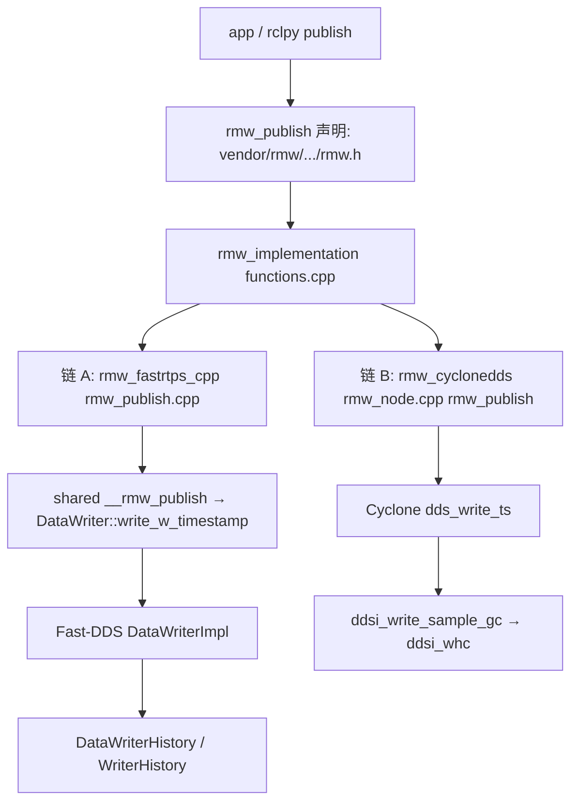

# ROS 2 源码地图（飞书《源码闭环》三条链 → 本仓路径）

Status: **地图 — 不是复现报告。**  
对照飞书《ROS 2 源码闭环》<https://topsunhzj.feishu.cn/wiki/N0Xaw1vsdiXRD4km9Jvc8kHynBf> 的 publish / ingress→History / wait→callback。只标**本树里核对过存在**的文件。决策见 [feishu-middleware-adr.md](feishu-middleware-adr.md)。复现执行状态（**map ≠ reproduce**，本主机 `STATUS: blocked`）：[feishu-three-chain-repro.md](feishu-three-chain-repro.md)。

**`publish()` / `rmw_publish()` 返回 `RMW_RET_OK` ≠ 对端已投递、已入 History、已 callback。** 那只是本进程把样本交给了 DataWriter / `dds_write_*`。端到端要另走 wait → take → executor。

本仓 **没有** vendor `rcl` / `rclcpp` / `rclpy`。Executor 与 `rcl_publish` 在 Humble 发行版（[`docker/ros/`](../../docker/ros/)，`ROS_DISTRO=humble`），不在 `vendor/`。vendor 树是 rolling / master 快照，**不是** Humble 源码；不要把下面路径当发行版补丁点。语义见 [vendor/MANIFEST.md](../../vendor/MANIFEST.md)。

---

## 0. Humble 运行时 vs rolling vendor

| 层 | 运行时（链 A Docker） | 本仓 `vendor/`（对照阅读） |
|----|----------------------|---------------------------|
| ROS distro | Humble（`docker/ros/Dockerfile` `ENV ROS_DISTRO=humble`） | **未** vendor `rcl` / `rclcpp` / `rclpy` |
| RMW API | 发行版 `librmw.so` | [`vendor/rmw/rmw/include/rmw/rmw.h`](../../vendor/rmw/rmw/include/rmw/rmw.h)（rolling，`package.xml` 写 `7.11.2`） |
| RMW 装载 | 发行版 `rmw_implementation` | [`vendor/rmw_implementation/rmw_implementation/src/functions.cpp`](../../vendor/rmw_implementation/rmw_implementation/src/functions.cpp) `load_library()` 读 `RMW_IMPLEMENTATION` |
| 链 A RMW | 发行版 `rmw_fastrtps_cpp` | [`vendor/rmw_fastrtps/`](../../vendor/rmw_fastrtps/)（rolling） |
| 链 A DDS | 发行版 Fast-DDS 2.x | [`vendor/Fast-DDS/`](../../vendor/Fast-DDS/)（`master` 快照） |
| 链 B RMW | 仅当 source 链 B | [`vendor/rmw_cyclonedds/rmw_cyclonedds_cpp/src/rmw_node.cpp`](../../vendor/rmw_cyclonedds/rmw_cyclonedds_cpp/src/rmw_node.cpp)（rolling） |
| 链 B DDS | 发行版或原生 `cyclonedds` | [`vendor/CycloneDDS/`](../../vendor/CycloneDDS/)（tag **11.0.1**） |

标识符字符串（vendor 源码里写死，运行时以 **已加载的 `.so`** 为准，用 [`scripts/prove_rmw.py`](../../scripts/prove_rmw.py) 核对）：

- `rmw_fastrtps_cpp` ← [`vendor/rmw_fastrtps/rmw_fastrtps_cpp/src/identifier.cpp`](../../vendor/rmw_fastrtps/rmw_fastrtps_cpp/src/identifier.cpp)
- `rmw_cyclonedds_cpp` ← [`vendor/rmw_cyclonedds/rmw_cyclonedds_cpp/src/rmw_node.cpp`](../../vendor/rmw_cyclonedds/rmw_cyclonedds_cpp/src/rmw_node.cpp)（`eclipse_cyclonedds_identifier`）

---

## 1. Publish 链

应用 `publisher.publish(msg)` → `rclpy` / `rcl`（**发行版，不在本仓**）→ `rmw_publish`（经 `rmw_implementation` 跳到具体 `.so`）。



| 步骤 | 链 A（Fast-DDS） | 链 B（Cyclone） |
|------|------------------|-----------------|
| RMW 入口 | [`vendor/rmw_fastrtps/rmw_fastrtps_cpp/src/rmw_publish.cpp`](../../vendor/rmw_fastrtps/rmw_fastrtps_cpp/src/rmw_publish.cpp) `rmw_publish` → [`.../rmw_fastrtps_shared_cpp/src/rmw_publish.cpp`](../../vendor/rmw_fastrtps/rmw_fastrtps_shared_cpp/src/rmw_publish.cpp) `__rmw_publish` | [`vendor/rmw_cyclonedds/rmw_cyclonedds_cpp/src/rmw_node.cpp`](../../vendor/rmw_cyclonedds/rmw_cyclonedds_cpp/src/rmw_node.cpp) `rmw_publish` → `dds_write_ts` |
| DDS write | [`vendor/Fast-DDS/src/cpp/fastdds/publisher/DataWriterImpl.cpp`](../../vendor/Fast-DDS/src/cpp/fastdds/publisher/DataWriterImpl.cpp) `write_w_timestamp` → `create_new_change*` → `perform_create_new_change` | [`vendor/CycloneDDS/src/core/ddsc/src/dds_write.c`](../../vendor/CycloneDDS/src/core/ddsc/src/dds_write.c) `dds_write` / `dds_write_ts` / `dds_write_impl` |
| Writer History | [`vendor/Fast-DDS/src/cpp/fastdds/publisher/DataWriterHistory.cpp`](../../vendor/Fast-DDS/src/cpp/fastdds/publisher/DataWriterHistory.cpp) `add_pub_change`；RTPS [`.../rtps/history/WriterHistory.cpp`](../../vendor/Fast-DDS/src/cpp/rtps/history/WriterHistory.cpp) | [`vendor/CycloneDDS/src/core/ddsi/src/ddsi_whc.c`](../../vendor/CycloneDDS/src/core/ddsi/src/ddsi_whc.c)（`ddsi_whc_insert`，见上游 [write-to-take.md](../../vendor/CycloneDDS/docs/dev/write-to-take.md)） |

装载：[`vendor/rmw_implementation/rmw_implementation/src/functions.cpp`](../../vendor/rmw_implementation/rmw_implementation/src/functions.cpp) 先读 `RMW_IMPLEMENTATION`，再 `DEFAULT_RMW_IMPLEMENTATION`，再 ament 里其它 `rmw_typesupport`。声明：[`vendor/rmw/rmw/include/rmw/rmw.h`](../../vendor/rmw/rmw/include/rmw/rmw.h) `rmw_publish` / `rmw_get_implementation_identifier`。

---

## 2. Ingress → History 链

网络 / 本机投递把样本放进 **Reader History**。这发生在 DDS 线程，**早于** ROS callback。

| 步骤 | 链 A | 链 B |
|------|------|------|
| RTPS / DDSI 收包 | [`vendor/Fast-DDS/src/cpp/rtps/reader/StatefulReader.cpp`](../../vendor/Fast-DDS/src/cpp/rtps/reader/StatefulReader.cpp) `change_received`；无状态侧 [`.../rtps/reader/StatelessReader.cpp`](../../vendor/Fast-DDS/src/cpp/rtps/reader/StatelessReader.cpp) | Cyclone 收包后 `rhc_store`（上游 write-to-take 图；实现 [`vendor/CycloneDDS/src/core/ddsi/src/ddsi_rhc.c`](../../vendor/CycloneDDS/src/core/ddsi/src/ddsi_rhc.c)） |
| Reader History | [`vendor/Fast-DDS/src/cpp/rtps/history/ReaderHistory.cpp`](../../vendor/Fast-DDS/src/cpp/rtps/history/ReaderHistory.cpp) `received_change` / `add_change` | 默认 RHC：[`vendor/CycloneDDS/src/core/ddsc/src/dds_rhc_default.c`](../../vendor/CycloneDDS/src/core/ddsc/src/dds_rhc_default.c)、[`.../ddsc/src/dds_rhc.c`](../../vendor/CycloneDDS/src/core/ddsc/src/dds_rhc.c) |

入 History ≠ 用户 callback 已跑。样本可以停在 reader cache 里，直到 `rmw_take`。

---

## 3. Wait → callback 链

ROS executor（Humble `rclcpp` / `rclpy`，**不在 vendor/**）循环：`rmw_wait` → 就绪则 `rmw_take` → 调订阅回调。加深（双链 WaitSet / 原生 listener）：[feishu-executor-waitset.md](feishu-executor-waitset.md)。

| 步骤 | 链 A | 链 B |
|------|------|------|
| `rmw_wait` | [`vendor/rmw_fastrtps/rmw_fastrtps_shared_cpp/src/rmw_wait.cpp`](../../vendor/rmw_fastrtps/rmw_fastrtps_shared_cpp/src/rmw_wait.cpp)（`WaitSet` / `GuardCondition` / `DataReader::get_first_untaken_info`）；DDS [`vendor/Fast-DDS/src/cpp/fastdds/core/condition/WaitSet.cpp`](../../vendor/Fast-DDS/src/cpp/fastdds/core/condition/WaitSet.cpp)、[`WaitSetImpl.cpp`](../../vendor/Fast-DDS/src/cpp/fastdds/core/condition/WaitSetImpl.cpp) | [`vendor/rmw_cyclonedds/rmw_cyclonedds_cpp/src/rmw_node.cpp`](../../vendor/rmw_cyclonedds/rmw_cyclonedds_cpp/src/rmw_node.cpp) `rmw_wait` → `dds_waitset_attach`；[`vendor/CycloneDDS/src/core/ddsc/src/dds_waitset.c`](../../vendor/CycloneDDS/src/core/ddsc/src/dds_waitset.c) |
| `rmw_take` | [`vendor/rmw_fastrtps/rmw_fastrtps_shared_cpp/src/rmw_take.cpp`](../../vendor/rmw_fastrtps/rmw_fastrtps_shared_cpp/src/rmw_take.cpp) | 同 `rmw_node.cpp` `rmw_take*` → `dds_take`；[`vendor/CycloneDDS/src/core/ddsc/src/dds_read.c`](../../vendor/CycloneDDS/src/core/ddsc/src/dds_read.c) |
| Executor / callback | **不在本仓。** Humble `/opt/ros/humble` 的 `rclcpp::Executor` / `rclpy.executors`。本仓只到 `rmw_wait` / `rmw_take`。 | 同左（ROS 客户端）。DimOS 原生链 B 不走 ROS executor，走 `DDSTransport` 的 Cyclone reader。 |

`rmw_wait` 声明：[`vendor/rmw/rmw/include/rmw/rmw.h`](../../vendor/rmw/rmw/include/rmw/rmw.h)。

---

## 4. 本仓明确没有的层

| 飞书常写的层 | 本仓 |
|--------------|------|
| `rcl` / `rclcpp` / `rclpy` 源码 | **无** vendor。复现这三层请用 Humble 发行版，不要拿 rolling `rmw_*.h` 去覆盖 `/opt/ros/humble`。 |
| Cega / 自研 Bridge | **Hold**（ADR §13(4)；[feishu-cega-bridge-hold.md](feishu-cega-bridge-hold.md)） |
| Agnocast / zenoh / eCAL / DPDK / Isaac | **不在树内**；Hold |
| 把三条链测出分位数并当根因 | **不是本文。** bench 另册；跨机 UDP 仍 blocked |

核对「进程到底加载了哪个 RMW / `.so`」：[`scripts/prove_rmw.py`](../../scripts/prove_rmw.py)（飞书 §6.3）。无 ROS 时仍退出 0。

机械核对本页引用的本仓路径 + 少量允许清单符号（WriterHistory `add_change`、StatefulReader `process_data_msg` / `change_received`、`rmw.h` 标识符、WaitSet / `rmw_wait` / `dds_take` 等）：[`scripts/check_source_map.py`](../../scripts/check_source_map.py)。WaitSet → callback 专页：[`scripts/check_executor_map.py`](../../scripts/check_executor_map.py)。

```bash
python3 scripts/check_source_map.py
```

无 ROS 时仍退出 0。行号过期但符号还在 → 警告；文件或符号消失 → 失败。只解析本文件，不扫整棵文档树。
